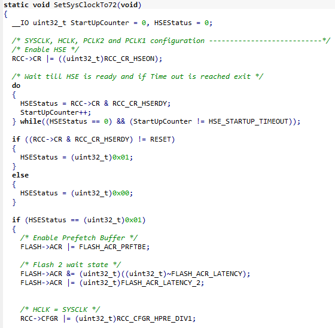
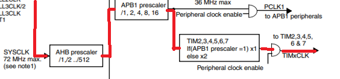

## 1. Timer
* LCD 버튼을 터치할 때 마다 LED가 각각 1, 5초 주기로 깜빡여야 한다.
* 따라서, 1초마다 timer에 의해 interrupt를 발생시키고, interrupt handler 내에서 LED1은 interrupt 발생 시 마다, LED2는 interrupt가 5번 발생할 때 마다 LED를 깜빡거리게 만들었다.
  * 처음에는 timer의 기준값과 시작값을 이용해 해당 값의 일치를 이용하여 interrupt하는 방식을 찾고자 했으나, timer의 interrut설정을 하는 `TIM_ITConfig`의 매개변수 중 타이머 값이 업데이트 될 때마다 interrupt를 발생시키는 것이 있어 해당 모드를 이용해 interrupt를 발생시켰다.
* Timer의 종류 중, 범용 목적의 General Purpose timer 중 TIM2를 사용하기로 했다.
* 우선, TIM2로 전달되는 clock을 확인하기 위해, SystemInit()함수의 SetSysClock()을 확인해보니, 해당 파일 내에서 SYSCLK_FREQ_72MHz가 define되어있었으므로 system clock은 72MHz임을 예상할 수 있었다. 실제로 `SetSysClockTo72()` 함수 내부를 보니, RCC 레지스터의 여러 설정을 통해 system clock을 72MHz로 설정함을 알 수 있었다.

* 또한, clock tree를 확인했을 때 TIMx로 가는 clock은 AHB prescaler와 APB1 prescaler를 거치는데, 따로 설정을 하지 않으면 /1이 되므로 72MHz clock이 그대로 TIMx로 들어가는 것을 알 수 있었다.

* TIM2에 대한 설정은 `TIM_TimeBaseInitTypeDef`로 해주었다.
  * TIM_Prescaler : timer의 분주 값을 설정한다. timer 업데이트 시간을 1초마다 해주기 위해, system clock이 72MHz이므로 우선 7200값을 주어 10kHz로 만들어 준다.
  * TIM_CounterMode : timer의 count를 어떤 모드로 할지 설정해준다. 이후 timer interrupt를 timer가 업데이트 될 때 마다 걸어주기 때문에, 어떤 모드를 사용해도 상관없으므로 TIM_CounterMode_Up을 사용하여 timer가 1씩 증가하도록 설정했다.
  * TIM_Period : timer의 주기를 설정한다. 분주에 의해 10kHz가 되었으므로, 10000값을 주어 1Hz로 만들어 준다.
  $$\frac{1}{72\;\text{MHz}}\times7200\times10000=\frac{1}{1\;\text{Hz}}=1 \text{sec}$$
  * TIM_ClockDivision : TIM clock값을 얼마로 나눌 지 설정한다. 계산된 clock 1Hz를 그대로 사용할 것이므로 나누지 않는다.(`TIM_CKD_DIV1`)
## 2. 코드
```C
void RCC_Configure(void)
{
	/* TIM2 Clock enable */
    RCC_APB1PeriphClockCmd(RCC_APB1Periph_TIM2, ENABLE); // GPIO와 달리, TIM은 APB1 clock을 사용한다.

    //...
}
```
```C
void GPIO_Configure(void)
{
    // GPIO 설정은 이전과 동일하게 설정한다.
    // LED1, 2에 해당하는 GPIOD 2, 3을 output push/pull로 설정해준다.

    //...
}
```
```C
void NVIC_Configure() {
    // NVIC 설정도 이전과 동일하게 설정한다. 단, IRQChannel만 IRQn_Type에서 찾아 TIM2로 설정한다.
   NVIC_InitTypeDef NVIC_InitStructure;
   NVIC_PriorityGroupConfig(NVIC_PriorityGroup_1);

   NVIC_InitStructure.NVIC_IRQChannel = TIM2_IRQn;
    // ...
}
```
```C
void initTimer() {
    // TIM2에 대한 설정을 한다.
    TIM_TimeBaseInitTypeDef TIM_InitStructure;
    TIM_InitStructure.TIM_Prescaler = 7200;     // prescaler 값은 7200
    TIM_InitStructure.TIM_CounterMode = TIM_CounterMode_Up; // counter 모드는 counter up
    TIM_InitStructure.TIM_Period = 10000;       // period 값은 10000
    TIM_InitStructure.TIM_ClockDivision = TIM_CKD_DIV1; // 나누기 1
    TIM_TimeBaseInit(TIM2, &TIM_InitStructure);
    
    TIM_ARRPreloadConfig(TIM2, ENABLE);
    TIM_Cmd(TIM2, ENABLE);      // TIM2 활성화
    TIM_ITConfig(TIM2, TIM_IT_Update, ENABLE);  // TIM2값이 업데이트 될 때마다 interrupt를 발생시킴.
}
```
* 여기서, `TIM_ARRPreloadConfig`는 Auto Reload Register를 활성화하는 함수인데, 원래는 강의자료에 해당 코드가 있어서 그대로 넣었다. 하지만, Auto reload가 될 기준 값을 설정하지도 않았고, interrupt는 timer값 업데이트 때 마다 발생하므로, 실제로는 해당 함수가 없어도 잘 작동할 것으로 예상한다.
```C
void TIM2_IRQHandler(void) {
    // TIM2의 interrupt handler.
    // 1초마다 이 handler가 실행이 되고, 전역 변수인 counter값을 증가시킨다.
    // led1, led2라는 변수를 이용해 led1,2를 켜고 끈다. 값이 1이면 led를 켜고, 0이면 led를 끈다.
    // led1은 이 handler가 실행될 때 마다(1초마다) 동작시키고, led2는 counter값이 5의 배수일 때 마다(5초마다) 동작시킨다.
  if(TIM_GetITStatus(TIM2, TIM_IT_Update) != RESET) {   // Timer가 업데이트 된다면
    printf("test\n");
    if(led1) {
      GPIO_SetBits(GPIOD, GPIO_Pin_2);
    } else {
      GPIO_ResetBits(GPIOD, GPIO_Pin_2);
    }
    
    led1 = !led1;
    
    if(led2) {
      GPIO_SetBits(GPIOD, GPIO_Pin_3);
    } else {
      GPIO_ResetBits(GPIOD, GPIO_Pin_3);
    }
    
    if(counter%5 == 0) {
      led2 = !led2;
    }
    counter++;
  }
  
  TIM_ClearITPendingBit(TIM2, TIM_IT_Update);
}
```
```C
int isOnButton(uint16_t x, uint16_t y) {
    // LCD를 터치한 좌표가 버튼 내인지 확인한다.
  if (x>=70 && x<=130 && y>=90 && y<=150) {
    return 1;
  }
  else {
    return 0;
  }
}
```
```C
int main(void)
{

    // 각종 초기 설정 함수들...

    while (1) {
    	// TODO: implement 
        LCD_ShowString(50, 50, "MON_Team01", BLUE, WHITE);
        // buttonStatus가 0이면 버튼이 꺼진 상태, 1이면 버튼이 켜진 상태.
        if(!buttonStatus) { // 버튼이 꺼진 상태면
          LCD_ShowString(50, 65, "OFF", BLACK, WHITE);
          TIM_Cmd(TIM2, DISABLE);   // TIM2의 작동을 멈춘다.
          GPIO_ResetBits(GPIOD, GPIO_Pin_2);
          GPIO_ResetBits(GPIOD, GPIO_Pin_3);
          counter = 0;
          led1=0;
          led2=0;
        } else {            // 버튼이 켜진 상태면
          LCD_ShowString(50, 65, "ON ", RED, WHITE);
          TIM_Cmd(TIM2, ENABLE);    // TIM2를 다시 작동시킨다.
        }
        
        LCD_DrawRectangle(70, 90, 130, 150);
        LCD_ShowString(80, 100, "But", BLACK, WHITE);
        
        Touch_GetXY(&xpos, &ypos, 1);
        Convert_Pos(xpos, ypos, &realx, &realy);
        
        if(isOnButton(realx, realy)) {
          buttonStatus = !buttonStatus;
          delay();
        }
    }
    return 0;
}    
```
### 2_1. 코드 전체
<details>
<summary>전체 코드</summary>
```C
#include "stm32f10x.h"
#include "stm32f10x_exti.h"
#include "stm32f10x_gpio.h"
#include "stm32f10x_usart.h"
#include "stm32f10x_rcc.h"
#include "stdio.h"
#include "lcd.h"
#include "touch.h"
#include "misc.h"

/* function prototype */
void RCC_Configure(void);
void GPIO_Configure(void);
void NVIC_Configure(void);
void ADC_Configure(void);
void Delay(void);

int color[12] = {WHITE,CYAN,BLUE,RED,MAGENTA,LGRAY,GREEN,YELLOW,BROWN,BRRED,GRAY};

int counter = 0;

uint16_t xpos;
uint16_t ypos;
uint16_t realx;
uint16_t realy;
int led1=0;
int led2=0;
int buttonStatus = 0;

void RCC_Configure(void)
{
	/* TIM2 Clock enable */
  RCC_APB1PeriphClockCmd(RCC_APB1Periph_TIM2, ENABLE);
	
	/* Alternate Function IO clock enable */
	RCC_APB2PeriphClockCmd(RCC_APB2Periph_AFIO, ENABLE);
  RCC_APB2PeriphClockCmd(RCC_APB2Periph_GPIOD, ENABLE);
}

void GPIO_Configure(void)
{
    GPIO_InitTypeDef GPIO_InitStructure;

    GPIO_InitStructure.GPIO_Pin = GPIO_Pin_2 | GPIO_Pin_3;      // LED1, LED2
    GPIO_InitStructure.GPIO_Mode = GPIO_Mode_Out_PP;       // Output mode push pull
    GPIO_InitStructure.GPIO_Speed = GPIO_Speed_50MHz;
    GPIO_Init(GPIOD, &GPIO_InitStructure);
  
}

void NVIC_Configure() {
   NVIC_InitTypeDef NVIC_InitStructure;
   NVIC_PriorityGroupConfig(NVIC_PriorityGroup_1);

   NVIC_InitStructure.NVIC_IRQChannel = TIM2_IRQn;
   NVIC_InitStructure.NVIC_IRQChannelCmd = ENABLE;
   NVIC_InitStructure.NVIC_IRQChannelPreemptionPriority = 0x00;
   NVIC_InitStructure.NVIC_IRQChannelSubPriority = 0x00;
   NVIC_Init(&NVIC_InitStructure);
   
   
}

void initTimer() {
  TIM_TimeBaseInitTypeDef TIM_InitStructure;
  TIM_InitStructure.TIM_Prescaler = 7200;
  TIM_InitStructure.TIM_CounterMode = TIM_CounterMode_Up;
  TIM_InitStructure.TIM_Period = 10000;
  TIM_InitStructure.TIM_ClockDivision = TIM_CKD_DIV1;
  TIM_TimeBaseInit(TIM2, &TIM_InitStructure);
  
  TIM_ARRPreloadConfig(TIM2, ENABLE);
  TIM_Cmd(TIM2, ENABLE);
  TIM_ITConfig(TIM2, TIM_IT_Update, ENABLE);
}

void TIM2_IRQHandler(void) {
  if(TIM_GetITStatus(TIM2, TIM_IT_Update) != RESET) {
    printf("test\n");
    if(led1) {
      GPIO_SetBits(GPIOD, GPIO_Pin_2);
    } else {
      GPIO_ResetBits(GPIOD, GPIO_Pin_2);
    }
    
    led1 = !led1;
    
    if(led2) {
      GPIO_SetBits(GPIOD, GPIO_Pin_3);
    } else {
      GPIO_ResetBits(GPIOD, GPIO_Pin_3);
    }
    
    if(counter%5 == 0) {
      led2 = !led2;
    }
    counter++;
  }
  
  TIM_ClearITPendingBit(TIM2, TIM_IT_Update);
}

int isOnButton(uint16_t x, uint16_t y) {
  if (x>=70 && x<=130 && y>=90 && y<=150) {
    return 1;
  }
  else {
    return 0;
  }
}

void delay() {
  for(int i=0;i<500;i++) {}
}

int main(void)
{

    SystemInit();

    RCC_Configure();

    GPIO_Configure();
    
    LCD_Init();
    Touch_Configuration();
    Touch_Adjust();
    LCD_Clear(WHITE);
    
    initTimer();

    NVIC_Configure();

    while (1) {
    	// TODO: implement 
        LCD_ShowString(50, 50, "MON_Team01", BLUE, WHITE);
        if(!buttonStatus) {
          LCD_ShowString(50, 65, "OFF", BLACK, WHITE);
          TIM_Cmd(TIM2, DISABLE);
          GPIO_ResetBits(GPIOD, GPIO_Pin_2);
          GPIO_ResetBits(GPIOD, GPIO_Pin_3);
          counter = 0;
          led1=0;
          led2=0;
        } else {
          LCD_ShowString(50, 65, "ON ", RED, WHITE);
          TIM_Cmd(TIM2, ENABLE);
        }
        
        LCD_DrawRectangle(70, 90, 130, 150);
        LCD_ShowString(80, 100, "But", BLACK, WHITE);
        
        Touch_GetXY(&xpos, &ypos, 1);
        Convert_Pos(xpos, ypos, &realx, &realy);        // touch adjust �ʿ�
        
        if(isOnButton(realx, realy)) {
          buttonStatus = !buttonStatus;
          delay();
        }
    }
    return 0;
}    
```
</details>