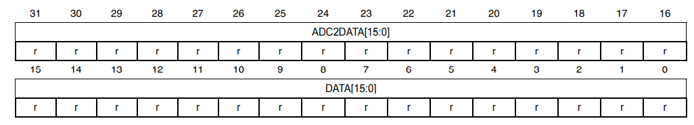
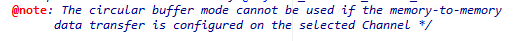

## 1. DMA
* DMA를 이용하여 조도센서의 값을 읽어와야 한다.
* 8주차 실험에서 진행한 ADC를 읽어오는 방식에서, Interrupt부분만 DMA를 사용하도록 바꾸면 될 것이라고 생각하여, interrupt나 NVIC를 설정하는 함수들을 제거하고, DMA를 설정하는 함수를 만들었다.
* ADC1이 DMA1 Channel1을 사용할 수 있으므로, DMA1 Channel1을 사용한다.
* 중간에 끊김없이 ADC값을 지속적으로 읽어야하므로 Circular Mode를 사용한다.
## 2. 코드
```C
void RCC_Configure(void)
{
    // ...

    RCC_AHBPeriphClockCmd(RCC_AHBPeriph_DMA1, ENABLE);
}
```
* Reference Manual을 통해, DMA1은 이전에 사용했던 APB clock을 사용하지 않고, AHB clock을 사용함을 확인할 수 있었다. 따라서, `RCC_AHBPeriphClockCmd`를 사용했다.
```C
void ADC_Configure(void) {
  //...

  ADC_DMACmd(ADC1, ENABLE);
  ADC_Cmd(ADC1, ENABLE);
}
```
* ADC의 다른 부분에 대한 코드는 이전과 거의 그대로 사용했다. GPIOC 0에 조도센서를 연결하였고, Independent모드를 사용하였다.
* 하지만, 이전에는 ADC의 값을 읽기 위해 ADC 변환이 완료될 때 마다 interrupt를 걸어주기 위해 `ADC_ITConfig`를 사용했지만, 이번에는 DMA를 사용하기 위해 `ADC_DMACmd`를 사용했다.
```C
void DMA_Configure(void) {
    DMA_InitTypeDef DMA_InitStructure; 
    DMA_DeInit(DMA1_Channel1); 
    DMA_InitStructure.DMA_PeripheralBaseAddr = (uint32_t) &ADC1->DR; 
    DMA_InitStructure.DMA_MemoryBaseAddr = (uint32_t) &ADC_Value; 
    DMA_InitStructure.DMA_DIR = DMA_DIR_PeripheralSRC; 
    DMA_InitStructure.DMA_BufferSize = 1; 
    
    DMA_InitStructure.DMA_PeripheralInc = DMA_PeripheralInc_Disable; 
    DMA_InitStructure.DMA_MemoryInc = DMA_MemoryInc_Enable; 
    DMA_InitStructure.DMA_PeripheralDataSize = DMA_PeripheralDataSize_HalfWord; 
    DMA_InitStructure.DMA_MemoryDataSize = DMA_MemoryDataSize_Word; 
    DMA_InitStructure.DMA_Mode = DMA_Mode_Circular; 
    DMA_InitStructure.DMA_Priority = DMA_Priority_High; 
    DMA_InitStructure.DMA_M2M = DMA_M2M_Disable; 
    DMA_Init(DMA1_Channel1, &DMA_InitStructure); 
    DMA_Cmd(DMA1_Channel1, ENABLE);
}
```
* DMA를 설정하고 사용하는 함수이다.
* DMA를 설정하는 structure는 definition을 통해 확인했고, 사용법은 헤더 파일 내의 주석과 reference manual을 참고했다.
* `DMA_PeripheralBaseAddr` : peripheral로부터 읽어올 register의 주소를 넣어야 한다. Reference Manual 11.8 DMA request를 보면, regular channel에서의 ADC의 변환의 완료될 때 마다 ADC_DR 레지스터의 값이 전달된다고 나와있었다. 또한, ADC 값이 저장되는 레지스터가 ADC_DR임을 확인할 수 있었다. 따라서, 주소값을 `&ADC->DR`로 넣었다.
* `DMA_MemoryBaseAddr` : 메인 메모리의 어디에 값을 저장할 지 정해야 한다. ADC1으로부터 읽어온 값을 저장해야 하므로, 단순히 전역 변수를 하나 만든 뒤 해당 변수의 주소값을 넘겨줬다.
* `DMA_DIR` : peripheral이 source가 될지, destination이 될 지 정해야 한다. peripheral(ADC1)로부터 데이터가 전송되어야 하므로, Source가 되어야 된다. 따라서 `DMA_DIR_PeripheralSRC`를 넣었다.
* `DMA_BufferSize` : 채널의 버퍼 크기를 데이터 단위로 정해야 한다. 데이터 단위는 이후에 나오는 DataSize와 동일하고, ADC로부터 변환된 값 1개를 읽어오므로 1 word로 충분하다 생각해 1 값을 넣었다.
* `DMA_PeripheralInc` : peripheral로부터 데이터를 읽어오면 peripherai의 주소값을 자동으로 증가시킬 지 정해야 한다. ADC_DR레지스터의 값을 지속적으로 읽어와야 하므로, 비활성화한다.
* `DMA_MemoryInc` : peripheral로부터 데이터를 읽어오면 메모리의 주소값을 자동으로 증가시킬 지 정해야 한다. Reference Manual 13.3.3에 따르면, 데이터를 읽어오면 데이터의 크기에 따라 주소값이 증가한다고 되어있었다.
  * 처음에는, ADC_Value라는 변수의 메모리 위치에 ADC값을 계속 저장하므로 주소값을 증가시키지 않아도 된다고 생각해 Disable시켰지만, 값을 제대로 읽어오지 못하는 문제가 있었다. Enable시키니 다시 정상적으로 값을 읽을 수 있었다.
  * 이는 Circular Mode에서도 NDT값이 감소하므로, 이 때문에 활성화해야 하는 것으로 보인다.
* `DMA_PeripheralDataSize` : peripheral로부터 읽어올 데이터의 크기를 결정한다. Reference Manual의 13.3.4부분에서, 예시로 들 때 halfword 0xABCD를 쓴다고 나와 있었으므로, 1 word는 32bit임을 알 수 있었다.
  * 또한, Reference Manual의 11.12.14를 확인하면, ADC_DR레지스터에서 ADC1의 값은 16bit만 사용하고, 나머지 16bit는 ADC2의 데이터를 저장하고 있음을 알 수 있었다. 따라서, halfword인 16bit를 읽기 위해 `DMA_PeripheralDataSize_HalfWord`를 넣었다.  
  
* `DMA_MemoryDataSize` : 메모리 데이터의 크기를 지정해야 한다. ADC값을 저장할 `ADC_Value`변수가 32bit 정수형이므로 1 word를 설정하기 위해 `DMA_MemoryDataSize_Word`를 넣었다.
* `DMA_Mode` : DMA의 모드를 설정해준다. ADC의 값을 지속적으로 읽기 위해 circular 모드로 지정한다.
* `DMA_Priority` : DMA의 우선순위를 설정한다. 설정 해주지 않아도 기본적으로 ADC1이므로 가장 높은 우선순위를 가지지만, 명시적으로 높은 우선순위를 설정해줬다.
* `DMA_M2M` : Memory to Memory 전송을 사용할 지 여부를 결정한다. ADC 레지스터로부터 메모리로 데이터가 이동하므로 사용하지 않을 뿐더러, 주석 부분을 확인해보니 circular mode와 m2m모드는 동시에 사용 불가능하다고 나와있어서 비활성화했다.  
  
* 이후, DMA1_Channel1에 DMA_Init을 이용하여 설정을 해주고, DMA_Cmd를 통해 활성화시켰다.
```C
int main(void)
{
    SystemInit();

    RCC_Configure();

    GPIO_Configure();
    ADC_Configure();
    DMA_Configure();
    
    LCD_Init();
    Touch_Configuration();

    LCD_Clear(WHITE);
    
    ADC_start();
    int threshold = 1500;

    while (1) {
      printf("light :%d\n", ADC_Value);
      if(ADC_Value < threshold) {
        LCD_Clear(GRAY);
        LCD_ShowNum(50, 50, ADC_Value, 4, BLACK, WHITE);
      } else {
        LCD_Clear(WHITE);
        LCD_ShowNum(50, 50, ADC_Value, 4, BLACK, WHITE);
      }
    }
    return 0;
}
```
* main 함수에서는 위에서 정의한 각종 설정 함수를 호출한 뒤, while문에서 지속적을 ADC값을 확인하여 임곗값(threshold)보다 낮으면 LCD 배경을 회색으로 출력하고, 높으면 LCD 배경을 흰색으로 출력했다.