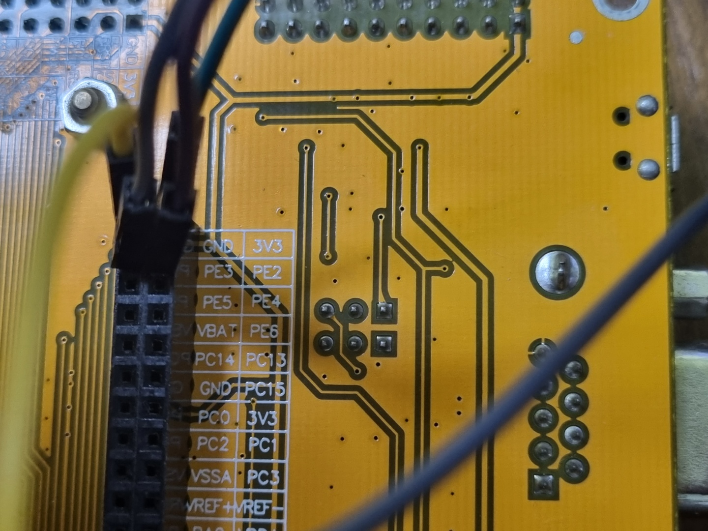

## 1. 회로
* 보드의 조이스틱 입력, 버튼 입력에 따라 모터 회전 정지, 시계방향 회전, 반시계방향 회전을 해야 한다.
* 모터의 한쪽은 VCC(전원, +), 다른 한 쪽은 GND(-)가 연결되어야 한다. 어느 쪽에 VCC를 연결하느냐에 따라 모터의 회전방향이 결정된다.
* 입력에 따라 회전 방향이 바뀌어야 하므로, 모터와 연결된 선은 VCC와 GND가 자유자재로 바뀌어야 한다. 따라서, 다음과 같이 모터를 구성한다.  
  
* 두 릴레이 모듈의 입력이 모두 HIGH거나 LOW라면, 두 모듈 다 NC쪽으로 닫히거나, NO쪽으로 닫히므로 모터는 동작하지 않는다.
  
  
* 두 릴레이 모듈 중, 하나는 입력이 HIGH, 하나는 입력이 LOW라면, HIGH입력이 들어온 릴레이 모듈은 NO쪽으로 닫히고, LOW입력이 들어온 쪽은 NC쪽으로 닫히게 된다. 따라서, 모터가 회전하게 된다.
  * 어느 쪽이 HIGH인지에 따라, 모터에 연결된 부분의 VCC, GND 입력이 바뀌므로 회전 방향이 달라지게 된다.
* stm32, 브레드 보드와 연결
  * 릴레이 모듈의 VCC, GND 입력은 각각 stm32 보드의 3v3, GND 핀과 연결한다. 한 모듈 당  하나의 핀만 사용한다.
  * 릴레이 모듈의 IN 입력은 GPIO PE2, PE3와 연결한다. 이후 코드에서 PE2, PE3의 HIGH, LOW를 설정해준다.
  
  
  * 모터와 릴레이 모듈은 위의 릴레이 모듈 - 모터 간 연결한 그림과 동일하게 연결해준다. 단, 릴레이 모듈의 NO와 연결된 전원은 반드시 **stm32보드가 아닌 배터리와 연결해줘야 한다**
    
> * 초반 실패 원인
>   * stm32보드의 3v3, GND 핀을 모터로 연결한 것이 문제. 전압 부족으로 모터, 릴레이 모듈 모든 게 정상 작동하지 않음. stm32보드의 3v3, GND는 릴레이 모듈에만 연결하고, 모터는 건전지와 직접 연결해야 정상 작동함.
>   * 릴레이 모듈 하나가 제대로 작동 안해 IN입력이 들어와도 LED로 표시가 되지 않아서 확인이 안됨
## 2. 코드
```c
#include "stm32f10x.h"
#include <stdio.h>

#define DOWN 0x04
#define UP 0x20

// RCC 0x40021018
// PORT C 0x40011000
// PORT D 0x40011400
// PORT E 0x40011800 
#define RCC_APB2ENR *((volatile unsigned int*) 0x40021018)       // clock 설정용 레지스터

#define GPIOC_CRL *((volatile unsigned int*) 0x40011000)         // C 포트 설정(조이스틱. PC2, 3, 4, 5)
#define GPIOC_IDR *((volatile unsigned int*) 0x40011008)         // C 포트 입력 받기(조이스틱)

#define GPIOD_CRH *((volatile unsigned int*) 0x40011404)         // D 포트 설정(스위치1. PD11)
#define GPIOD_IDR *((volatile unsigned int*) 0x40011408)         // D 포트 입력 받기(스위치1)

#define GPIOE_CRL *((volatile unsigned int*) 0x40011800)         // E포트 설정(PE2, 3 핀 출력)
#define GPIOE_BSRR *((volatile unsigned int*) 0x40011810)        // E포트 set, reset(PE2, 3 핀 HIGH, LOW 설정)

#define D_ON 0x800                                               // 스위치 입력 들어왔는지 확인 용도

// PE2,3의 핀 set, reset이 동시에 일어나면 모터에 과전류가 흐를 수 있으므로,
// set과 reset간에 시간 간격을 두기 위한 delay 함수
void delay() {
  int i;
  for (i=0; i<10000000; i++) {
  }
}

int main(void)
{
  // RCC_APB2ENR
  RCC_APB2ENR &= ~0x000000FF;
  RCC_APB2ENR |= (0x7<<4);  // GPIO포트 C,D,E를 사용하므로 해당하는 3bit 클락 설정
  
  // stick
  GPIOC_CRL &= 0x00000000;
  GPIOC_CRL = 0x00888800;   // 조이스틱 포트 세팅
  
  //swtich
  GPIOD_CRH &= 0x00000000;
  GPIOD_CRH = 0x00008000;   // 스위치(USER S1) 포트 세팅. PD11이므로 CRL이 아닌 CRH사용.
  
  // out
  GPIOE_CRL &= ~0x0000FF00;
  GPIOE_CRL |= 0x00003300;  // 릴레이 모듈 IN입력을 위한 E 포트 세팅. 
                            // PE2, 3을 사용하고 output 모드이므로 0x3(0011) 사용.
 
  while(1) {
    if(!( GPIOD_IDR & D_ON)) {  // D포트 입력을 받는 레지스터에서 스위치가 눌렸을 때
      GPIOE_BSRR &= ~0x000F0000;
      GPIOE_BSRR |= 0x000C0000;     // PE 2, 3에 해당하는 bit를 reset함   
      
      printf("on");
    }
    
    if(!( GPIOC_IDR & UP)) {    // C포트 입력을 받는 레지스터에서 조이스틱을 위로 놓으면
      GPIOE_BSRR &= ~0x0000000F;
      GPIOE_BSRR |= 0x00000008;     // PE3 bit를 1로 set하고
      delay();                      // delay를 준 뒤,
      GPIOE_BSRR &= ~0x000F0000;
      GPIOE_BSRR |= 0x00040000;     // PE2 bit를 reset
      
      printf("up");
    }
    else if(!( GPIOC_IDR & DOWN)) { // C포트 입력을 받는 레지스터에서 조이스틱을 아래로 놓으면
      GPIOE_BSRR &= ~0x0000000F;
      GPIOE_BSRR |= 0x00000004;     // PE2 bit를 1로 set하고
      delay();                      // delay를 준 뒤,
      GPIOE_BSRR &= ~0x000F0000;
      GPIOE_BSRR |= 0x00080000;     // PE3 bit를 reset
      
      printf("down");
    }
  }

  return 0;
}
```
> 레지스터는 3주차와 거의 동일하게 사용하므로 설명 생략