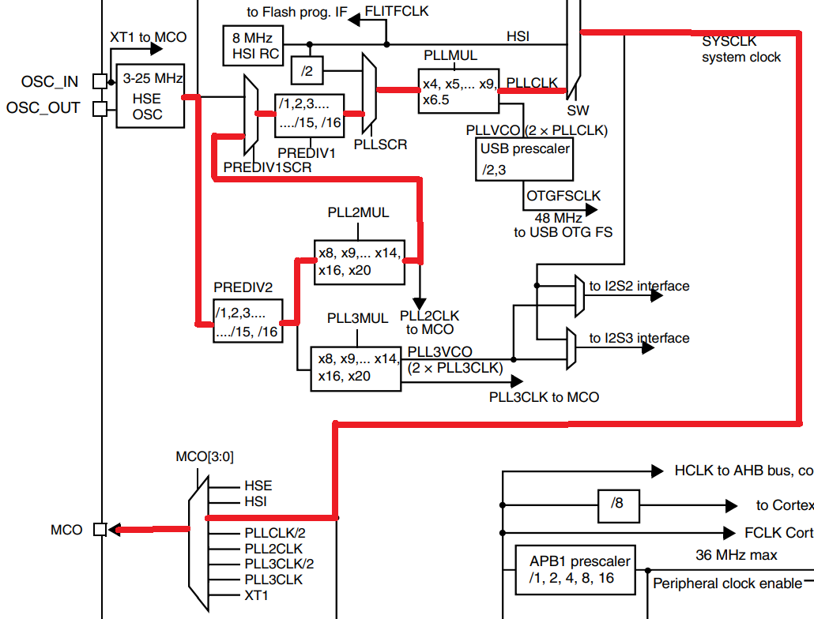
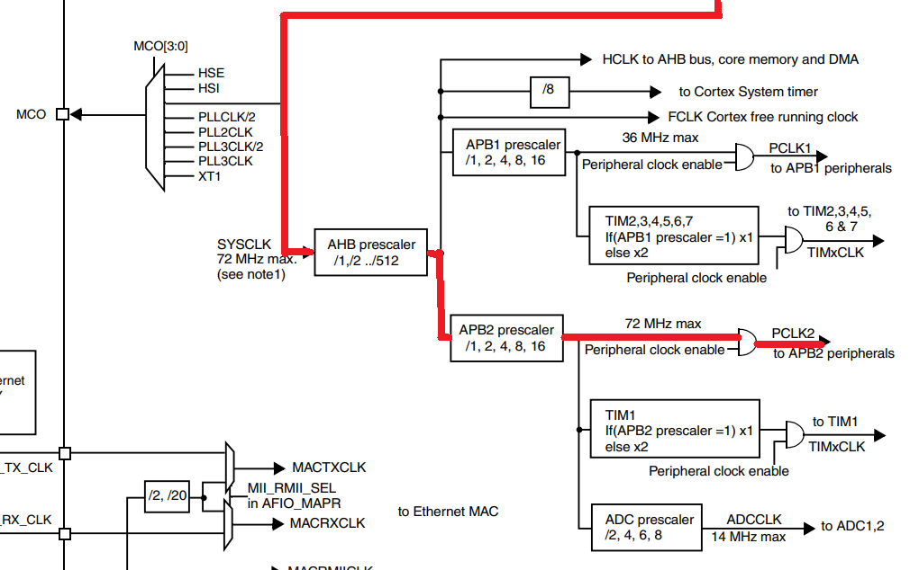

## 1. Clock
* Clock은 여러 종류가 존재
  * HSI Clock : 8MHz RC Oscillator에서 생성되는 clock. 나온 clock을 바로 사용하거나(`HSI`), 나온 clock에 나누기 2, 곱하기 PLLMUL값을 clock으로 사용할 수도 있음(`PLLCLK`).
  * HSE Clock : HSE OSC에서 25MHz의 clock을 생성. 나온 clock을 바로 사용하거나(`HSE`), 나온 clock에 여러 계산 과정을 거쳐 다른 clock을 만들어 사용할 수도 있음(`PLLCLK`)
  
  * 5주차 코드에서는 HSE clock을 사용하고, HSE clock 25MHz을 PLL Clock 28MHz로 만든 뒤 사용할 것이다.(빨간색 라인)
  * 빨간색 라인을 따라가려면, `RCC_CFGR`, `RCC_CFGR2` 레지스터를 이용해 여러 설정을 해줘야 한다. HSE clock은 순서대로 `PREDIV2` -> `PLL2MUL` -> `PREDIV1SCR` -> `PREDIV1` -> `PLLSCR` -> `PLLMUL` -> `SW`를 거쳐 `SYSCLK`이 될 것이다.
  * 25MHz를 28MHz로 만들려면 25 / 5 \* 8 / 10 \* 7 = 28MHz가 된다. 따라서, `RCC_CFGR`, `RCC_CFGR2` 레지스터를 이용해 아래와 같이 설정해야한다. (ReferenceManual 8.3.2, 8.3.12 참고)

  |그림에서의 명칭|`PREDIV2`|`PLL2MUL`|`PREDIV1SCR`|`PREDIV1`|`PLLSCR`|`PLLMUL`|`SW`|
  |--------------|---------|---------|------------|---------|--------|--------|----|
  |레지스터     |`RCC_CFGR2`|`RCC_CFGR2`|`RCC_CFGR2`|`RCC_CFGR2`|`RCC_CFGR`|`RCC_CFGR`|`RCC_CFGR`|
  |레지스터 필드|`PREDIV2[3:0]`|`PLL2MUL[3:0]`|`PREDIV1SRC`|`PREDIV1[3:0]`|`PLLSRC`|`PLLMUL[3:0]`|`SW[1:0]`|
  |값|/5       |x8       |아래쪽 선택(PLL2)  |/10      |아래쪽 선택(PREDIV1에서 나온 clock)|x7    |PLLCLK 선택|
  |bit 값|`0100`       |`0110`       |`1`  |`1001`      |`1`|`0101`    |`10`|
  |헤더 파일에 정의된 주소값|`RCC_CFGR2_PREDIV2_DIV5`|`RCC_CFGR2_PLL2MUL8`|`RCC_CFGR2_PREDIV1SRC_PLL2`|`RCC_CFGR2_PREDIV1_DIV10`|`RCC_CFGR_PLLSRC_PREDIV1`|`RCC_CFGR_PLLMULL7`|`RCC_CFGR_SW_PLL`|

* HSI, HSE, PLLCLK 셋 중 하나를 선택한 것이 시스템 클럭 (`SYSCLK`)이 되고, 이 클럭이 보드에서 사용할 clock이 됨.
* 만들어진 clock을 보드의 MCO 핀을 이용해 직접적으로 확인하려면, MCO로 출력할 값 중 시스템 클럭 `SYSCLK`을 선택하면 MCO핀으로 만들어진 clock을 출력할 수 있음. (`RCC_CFGR` 레지스터의 `MCO[3:0]`부분 bit를 `0100` (헤더 파일에서는 `RCC_CFGR_MCO_SYSCLK `)으로 설정)
* 만들어진 시스템 clock은 이후 AHB prescaler, APB2 prescaler를 거쳐 PCLK2로 제공. 제공된 clock은 APB2로 제공되고, 이를 보드의 각종 핀에 설정 가능함(`APB2ENR`)

> 빨간색 라인이 SYSCLK이 PCLK2로 가는 과정.

## 2. Baud Rate
* UART 통신 시, 송신 측과 수신 측의 Baud Rate를 일치시켜야 함.
* 수신 측(Putty)의 baud rate(speed)를 28800으로 설정했으므로, 송신 측(보드)도 동일하게 설정
* stm32 보드에서 baud rate는 `USART_BRR` 레지스터를 설정함으로써 지정 가능함.
* 보드의 clock과 원하는 baud rate를 이용해, Reference Manual 27.3.4에 나와있는 방법대로 `USARTDIV`를 계산하여, 계산된 값을 `USART_BRR`에 넣어줘야 한다.
  * $\displaystyle\text{Tx/Rx baud} = \frac{f_{CK}}{16*\text{USARTDIV}}$에서 USARTDIV를 구해야 하므로, $\displaystyle\text{USARTDIV} = \frac{f_{CK}}{16*\text{Tx/Rx baud}}$가 된다. 
  * $f_{CK}$는 보드의 clock으로, 위에서 본 것과 같이 시스템 클락은 28MHz이고, 이후 아래 코드에서 APB2 prescaler에 의해 나누기 2한 만큼의 clock을 APB2에서 사용하므로 14MHz가 된다. $\text{Tx/Rx baud}$는 putty에서 28800으로 설정했으므로 여기서도 동일하게 28800이다. 
  * 따라서, $\displaystyle\text{USARTDIV} = \frac{14,000,000}{16*28800}\approx 30.38$이다.
  * Reference Manual의 계산 방법에 따라, `DIV_Fraction`은 소수점 아래 부분\*16인 $16*0.38=6.08\approx 6$이므로 `DIV_Fraction` = 6 = `0x6`.
  * `DIV_Mantissa`는 정수 부분인 30=`0x1E`가 된다.
  * 따라서, `USART_BRR`레지스터의 값을 `0x1E6`으로 설정하면 된다.

## 3-1. 코드(전체)
<details>
<summary>전체 코드</summary>

```C
#include "stm32f10x.h"
#include "stm32f10x_usart.h"
#include <stdio.h>

void SysInit(void) {
    /* Set HSION bit */
    /* Internal Clock Enable */
    RCC->CR |= (uint32_t)0x00000001; //HSION

    /* Reset SW, HPRE, PPRE1, PPRE2, ADCPRE and MCO bits */
    RCC->CFGR &= (uint32_t)0xF0FF0000;

    /* Reset HSEON, CSSON and PLLON bits */
    RCC->CR &= (uint32_t)0xFEF6FFFF;

    /* Reset HSEBYP bit */
    RCC->CR &= (uint32_t)0xFFFBFFFF;

    /* Reset PLLSRC, PLLXTPRE, PLLMUL and USBPRE/OTGFSPRE bits */
    RCC->CFGR &= (uint32_t)0xFF80FFFF;

    /* Reset PLL2ON and PLL3ON bits */
    RCC->CR &= (uint32_t)0xEBFFFFFF;

    /* Disable all interrupts and clear pending bits  */
    RCC->CIR = 0x00FF0000;

    /* Reset CFGR2 register */
    RCC->CFGR2 = 0x00000000;
}

void SetSysClock(void) {
    volatile uint32_t StartUpCounter = 0, HSEStatus = 0;
    /* SYSCLK, HCLK, PCLK2 and PCLK1 configuration ---------------------------*/
    /* Enable HSE */
    RCC->CR |= ((uint32_t)RCC_CR_HSEON);
    /* Wait till HSE is ready and if Time out is reached exit */
    do {
        HSEStatus = RCC->CR & RCC_CR_HSERDY;
        StartUpCounter++;
    } while ((HSEStatus == 0) && (StartUpCounter != HSE_STARTUP_TIMEOUT));

    if ((RCC->CR & RCC_CR_HSERDY) != RESET) {
        HSEStatus = (uint32_t)0x01;
    }
    else {
        HSEStatus = (uint32_t)0x00;
    }

    if (HSEStatus == (uint32_t)0x01) {
        /* Enable Prefetch Buffer */
        FLASH->ACR |= FLASH_ACR_PRFTBE;
        /* Flash 0 wait state */
        FLASH->ACR &= (uint32_t)((uint32_t)~FLASH_ACR_LATENCY);
        FLASH->ACR |= (uint32_t)FLASH_ACR_LATENCY_0;

//@TODO - 1 Set the clock, (//) ??? ????? ????? ??? ???? ???? ????? ?? ?????? ??????y? 
        /* HCLK = SYSCLK */
        RCC->CFGR |= (uint32_t)RCC_CFGR_HPRE_DIV1;
        /* PCLK2 = HCLK / ?, use PPRE2 */
        RCC->CFGR |= (uint32_t)RCC_CFGR_PPRE2_DIV2;     // SYSCLCK / 2
        /* PCLK1 = HCLK */
        RCC->CFGR |= (uint32_t)RCC_CFGR_PPRE1_DIV1;     // SYSCLCK

        /* Configure PLLs ------------------------------------------------------*/
        RCC->CFGR &= (uint32_t)~(RCC_CFGR_PLLXTPRE | RCC_CFGR_PLLSRC | RCC_CFGR_PLLMULL);
        RCC->CFGR |= (uint32_t)(RCC_CFGR_PLLXTPRE_PREDIV1 | RCC_CFGR_PLLSRC_PREDIV1 | RCC_CFGR_PLLMULL7);

        RCC->CFGR2 &= (uint32_t)~(RCC_CFGR2_PREDIV2 | RCC_CFGR2_PLL2MUL | RCC_CFGR2_PREDIV1 | RCC_CFGR2_PREDIV1SRC);
        RCC->CFGR2 |= (uint32_t)(RCC_CFGR2_PREDIV2_DIV5 | RCC_CFGR2_PLL2MUL8 | RCC_CFGR2_PREDIV1SRC_PLL2 | RCC_CFGR2_PREDIV1_DIV10);
//@End of TODO - 1

        /* Enable PLL2 */
        RCC->CR |= RCC_CR_PLL2ON;
        /* Wait till PLL2 is ready */
        while ((RCC->CR & RCC_CR_PLL2RDY) == 0)
        {
        }
        /* Enable PLL */
        RCC->CR |= RCC_CR_PLLON;
        /* Wait till PLL is ready */
        while ((RCC->CR & RCC_CR_PLLRDY) == 0)
        {
        }
        /* Select PLL as system clock source */
        RCC->CFGR &= (uint32_t)((uint32_t)~(RCC_CFGR_SW));
        RCC->CFGR |= (uint32_t)RCC_CFGR_SW_PLL;
        /* Wait till PLL is used as system clock source */
        while ((RCC->CFGR & (uint32_t)RCC_CFGR_SWS) != (uint32_t)0x08)
        {
        }
        /* Select System Clock as output of MCO */
//@TODO - 2 Set the MCO port for system clock output
        RCC->CFGR &= ~(uint32_t)RCC_CFGR_MCO;
        RCC->CFGR |= RCC_CFGR_MCO_SYSCLK;
//@End of TODO - 2
    }
    else {
        /* If HSE fails to start-up, the application will have wrong clock
        configuration. User can add here some code to deal with this error */
    }
}

void RCC_Enable(void) {
//@TODO - 3 RCC Setting
    /*---------------------------- RCC Configuration -----------------------------*/
    /* GPIO RCC Enable  */
    /* UART Tx, Rx, MCO port */
    RCC->APB2ENR |= RCC_APB2ENR_IOPAEN;
    /* USART RCC Enable */
    RCC->APB2ENR |= RCC_APB2ENR_USART1EN;
    /* User S1 Button RCC Enable */
    RCC->APB2ENR |= RCC_APB2ENR_IOPDEN;
}
void PortConfiguration(void) {
//@TODO - 4 GPIO Configuration
    /* Reset(Clear) Port A CRH - MCO, USART1 TX,RX*/
    GPIOA->CRH &= ~(
	    (GPIO_CRH_CNF8 | GPIO_CRH_MODE8) |
	    (GPIO_CRH_CNF9 | GPIO_CRH_MODE9) |
	    (GPIO_CRH_CNF10 | GPIO_CRH_MODE10)
	);
    /* MCO Pin Configuration */
    GPIOA->CRH |= (GPIO_CRH_MODE8 | GPIO_CRH_CNF8_1);
    /* USART Pin Configuration */
    GPIOA->CRH |= (GPIO_CRH_MODE9 | GPIO_CRH_CNF9_1 | GPIO_CRH_CNF10_1);
    
    /* Reset(Clear) Port D CRH - User S1 Button */
    GPIOD->CRH &= ~(GPIO_CRH_CNF11 | GPIO_CRH_MODE11);
    /* User S1 Button Configuration */
    GPIOD->CRH |= GPIO_CRH_CNF11_1;
}

void UartInit(void) {
    /*---------------------------- USART CR1 Configuration -----------------------*/
    /* Clear M, PCE, PS, TE and RE bits */
    USART1->CR1 &= ~(uint32_t)(USART_CR1_M | USART_CR1_PCE | USART_CR1_PS | USART_CR1_TE | USART_CR1_RE);
    /* Configure the USART Word Length, Parity and mode ----------------------- */
    /* Set the M bits according to USART_WordLength value */
//@TODO - 6: WordLength : 8bit
    USART1->CR1 |= USART_WordLength_8b;
    /* Set PCE and PS bits according to USART_Parity value */
    
//@TODO - 7: Parity : None
    USART1->CR1 |= USART_Parity_No;
    /* Set TE and RE bits according to USART_Mode value */
//@TODO - 8: Enable Tx and Rx
    USART1->CR1 |= (USART_Mode_Rx | USART_Mode_Tx);

    /*---------------------------- USART CR2 Configuration -----------------------*/
    /* Clear STOP[13:12] bits */
    USART1->CR2 &= ~(uint32_t)(USART_CR2_STOP);
    /* Configure the USART Stop Bits, Clock, CPOL, CPHA and LastBit ------------*/
    USART1->CR2 &= ~(uint32_t)(USART_CR2_CPHA | USART_CR2_CPOL | USART_CR2_CLKEN);
    /* Set STOP[13:12] bits according to USART_StopBits value */
//@TODO - 9: Stop bit : 1bit
    USART1->CR2 |= USART_StopBits_1;

    /*---------------------------- USART CR3 Configuration -----------------------*/
    /* Clear CTSE and RTSE bits */
    USART1->CR3 &= ~(uint32_t)(USART_CR3_CTSE | USART_CR3_RTSE);
    /* Configure the USART HFC -------------------------------------------------*/
    /* Set CTSE and RTSE bits according to USART_HardwareFlowControl value */
//@TODO - 10: CTS, RTS : disable
    USART1->CR3 |= USART_HardwareFlowControl_None;
    /*---------------------------- USART BRR Configuration -----------------------*/
    /* Configure the USART Baud Rate -------------------------------------------*/
    /* Determine the integer part */
    /* Determine the fractional part */
//@TODO - 11: Calculate & configure BRR
    USART1->BRR |= 0x1E6;

    /*---------------------------- USART Enable ----------------------------------*/
    /* USART Enable Configuration */
//@TODO - 12: Enable UART (UE)
    USART1->CR1 |= 0x2000;
}

void delay(void){
    int i = 0;
    for(i=0;i<1000000;i++);
}

void SendData(uint16_t data) {
    /* Transmit Data */
	USART1->DR = data;

	/* Wait till TC is set */
	while ((USART1->SR & USART_SR_TC) == 0);
}

int main() {
	int i;
	char msg[] = "Hello Team01\r\n";
	
    SysInit();
    SetSysClock();
    RCC_Enable();
    PortConfiguration();
    UartInit();
    
    // if you need, init pin values here
    
    
    while (1) {
		//@TODO - 13: Send the message when button is pressed
		if( !(GPIOD->IDR & GPIO_IDR_IDR11)) {
                    char* temp = msg;
                    for(int i=0; msg[i]!='\0'; i++) {
                        SendData(msg[i]);
                    }
                }
    }

}// end main
```
</details>

## 3-2. 코드(TODO)
```C
//@TODO - 1 Set the clock, (//)
        /* HCLK = SYSCLK */
        RCC->CFGR |= (uint32_t)RCC_CFGR_HPRE_DIV1;      // AHB prescaler설정. /1이므로 28MHz SYSCLK을 그대로 사용
        /* PCLK2 = HCLK / ?, use PPRE2 */
        RCC->CFGR |= (uint32_t)RCC_CFGR_PPRE2_DIV2;     // APB2 prescaler설정. /2이므로 14MHz가 PCLK2가 됨. 즉, APB2로 출력되는 clock이 최종적으로는 14MHz가 됨.
        /* PCLK1 = HCLK */
        RCC->CFGR |= (uint32_t)RCC_CFGR_PPRE1_DIV1;     // APB1 prescaler설정. 여기선 안씀.

        /* Configure PLLs ------------------------------------------------------*/
        RCC->CFGR &= (uint32_t)~(RCC_CFGR_PLLXTPRE | RCC_CFGR_PLLSRC | RCC_CFGR_PLLMULL);
        RCC->CFGR |= (uint32_t)(RCC_CFGR_PLLXTPRE_PREDIV1 | RCC_CFGR_PLLSRC_PREDIV1 | RCC_CFGR_PLLMULL7);   // PLLSCR, PLLMUL 설정. 위 설명 참고

        RCC->CFGR2 &= (uint32_t)~(RCC_CFGR2_PREDIV2 | RCC_CFGR2_PLL2MUL | RCC_CFGR2_PREDIV1 | RCC_CFGR2_PREDIV1SRC);
        RCC->CFGR2 |= (uint32_t)(RCC_CFGR2_PREDIV2_DIV5 | RCC_CFGR2_PLL2MUL8 | RCC_CFGR2_PREDIV1SRC_PLL2 | RCC_CFGR2_PREDIV1_DIV10);    // PREDIV2, PLL2MUL, PREDIV1SCR, PREDIV1 설정. 위 설명 참고
//@End of TODO - 1
```
```C
//@TODO - 2 Set the MCO port for system clock output
        RCC->CFGR &= ~(uint32_t)RCC_CFGR_MCO;
        RCC->CFGR |= RCC_CFGR_MCO_SYSCLK;   // MCO가 SYSCLK를 선택하도록 설정. 위 설명 참고
//@End of TODO - 2
```
```C
void RCC_Enable(void) {
//@TODO - 3 RCC Setting
    // PCLK2로 나온 clock 14MHz를 사용하고자 하는 핀에 설정해줘야 함.
    // RCC_APB2ENR레지스터를 사용. (레지스터 및 값은 stm32f10x.h에 있음.)
    /*---------------------------- RCC Configuration -----------------------------*/
    /* GPIO RCC Enable  */
    /* UART Tx, Rx, MCO port */
    RCC->APB2ENR |= RCC_APB2ENR_IOPAEN; // GPIO A 포트 clock 설정(MCO, USART1_TX, USART1_RX에 사용. 각각 PA8, PA9, PA10. 강의자료 23p 참고)
    /* USART RCC Enable */
    RCC->APB2ENR |= RCC_APB2ENR_USART1EN;  // USART1 포트 clock 설정(보드와 putty간 통신에 사용)
    /* User S1 Button RCC Enable */
    RCC->APB2ENR |= RCC_APB2ENR_IOPDEN; // GPIO D 포트 clock 설정(버튼 S1 USER. PD11)
}
```
```C
void PortConfiguration(void) {
//@TODO - 4 GPIO Configuration
    /* Reset(Clear) Port A CRH - MCO, USART1 TX,RX*/
    GPIOA->CRH &= ~(
	    (GPIO_CRH_CNF8 | GPIO_CRH_MODE8) |
	    (GPIO_CRH_CNF9 | GPIO_CRH_MODE9) |
	    (GPIO_CRH_CNF10 | GPIO_CRH_MODE10)
	);
    /* MCO Pin Configuration */
    GPIOA->CRH |= (GPIO_CRH_MODE8 | GPIO_CRH_CNF8_1);   // PA8(MCO)의 pin mode를 Alternate function output Push-pull로 설정.  
                                                        // GPIO_CRH_MODE8은 출력 모드(11), GPIO_CRH_CNF8_1은 Alternate function output push-pull 설정(10)
    /* USART Pin Configuration */
    GPIOA->CRH |= (GPIO_CRH_MODE9 | GPIO_CRH_CNF9_1 | GPIO_CRH_CNF10_1);    // PA9(USART TX)의 pin mode는 Alternate function output Push-pull로 설정
                                                                            // PA10(USART RX)의 pin mode는 Input with pull-up/pull-down으로 설정
                                                                            // GPIO_CRH_MODE9 | GPIO_CRH_CNF9_1는 위와 동일
                                                                            // GPIO_CRH_MODE10이 없는 이유는, 입력 모드로 설정하려면 00bit로 설정해야 하기 때문
    
    /* Reset(Clear) Port D CRH - User S1 Button */
    GPIOD->CRH &= ~(GPIO_CRH_CNF11 | GPIO_CRH_MODE11);
    /* User S1 Button Configuration */
    GPIOD->CRH |= GPIO_CRH_CNF11_1; // PD11(버튼)의 pin mode를 Input with pull-up/pull-down으로 설정
}
```
```C
void UartInit(void) {
/** USART 설정을 위한 부분
 * 
 * USART_CR1, USART_CR2, USART_CR3 레지스터로 여러 설정 가능. (Reference Manual 27.6.4, 27.6.5, 27.6.6 참고)
 * USART관련된 값들은 stm32f10x_usart.h에 있음(USART_WordLength_8b 같은 것들)
 * 
 * USART_BRR에 Baud rate 설정 필요. (Reference Manual 27.6.3 참고)
 */

//@TODO - 6: WordLength : 8bit
    USART1->CR1 |= USART_WordLength_8b; // wordlength를 8bit로 설정(0b0)
    /* Set PCE and PS bits according to USART_Parity value */
    
//@TODO - 7: Parity : None
    USART1->CR1 |= USART_Parity_No;     // parity를 No로 설정(0b0)
    /* Set TE and RE bits according to USART_Mode value */
//@TODO - 8: Enable Tx and Rx
    USART1->CR1 |= (USART_Mode_Rx | USART_Mode_Tx); // Tx, Rx활성화(TE, RE 필드에 각각 1bit 설정.)

    /*---------------------------- USART CR2 Configuration -----------------------*/
    /* Clear STOP[13:12] bits */
    USART1->CR2 &= ~(uint32_t)(USART_CR2_STOP);
    /* Configure the USART Stop Bits, Clock, CPOL, CPHA and LastBit ------------*/
    USART1->CR2 &= ~(uint32_t)(USART_CR2_CPHA | USART_CR2_CPOL | USART_CR2_CLKEN);
    /* Set STOP[13:12] bits according to USART_StopBits value */
//@TODO - 9: Stop bit : 1bit
    USART1->CR2 |= USART_StopBits_1; // Stop bit를 1 stop bit로 설정. (0b00)

    /*---------------------------- USART CR3 Configuration -----------------------*/
    /* Clear CTSE and RTSE bits */
    USART1->CR3 &= ~(uint32_t)(USART_CR3_CTSE | USART_CR3_RTSE);
    /* Configure the USART HFC -------------------------------------------------*/
    /* Set CTSE and RTSE bits according to USART_HardwareFlowControl value */
//@TODO - 10: CTS, RTS : disable
    USART1->CR3 |= USART_HardwareFlowControl_None;  // CTS, RTS 비활성화(CTSE, RTSE 필드에 각각 0bit 설정. 즉, 이 라인은 없어도 무방.)

// ...

//@TODO - 11: Calculate & configure BRR
    USART1->BRR |= 0x1E6;   // Baud rate 설정. 위 Baud Rate 설명 참고 및 강의자로 24p 참고.

/*---------------------------- USART Enable ----------------------------------*/
    /* USART Enable Configuration */
//@TODO - 12: Enable UART (UE)
    USART1->CR1 |= 0x2000;  // USART 활성화. Reference Manual에 보면 USART_CR1의 13번째 bit를 이용해 활성화할 수 있으므로 0x2000(0b10 0000 0000 0000) 을 or 연산
```
```C
void SendData(uint16_t data) {
    /* Transmit Data */
	USART1->DR = data;

	/* Wait till TC is set */
	while ((USART1->SR & USART_SR_TC) == 0);
}

int main() {
	int i;
	char msg[] = "Hello Team01\r\n";
	
    SysInit();
    SetSysClock();
    RCC_Enable();
    PortConfiguration();
    UartInit();
    
    // if you need, init pin values here
    
    
    while (1) {
        // 버튼을 입력했을 때, UART를 이용해 msg에 저장된 문자열을 putty로 보내야 함.
        // 데이터를 보내는 함수는 위의 SendData. 매개변수 자료형이 uint16_t(unsigned short)이므로 한 글자씩 보낼 수 있음.
        // 따라서, 문자열을 보내려면 문자열의 문자를 하나씩 보내면 됨.
		//@TODO - 13: Send the message when button is pressed
		if( !(GPIOD->IDR & GPIO_IDR_IDR11)) {
            for(int i=0; msg[i]!='\0'; i++) {
                SendData(msg[i]);
            }
        }
    }

}// end main
```