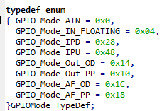
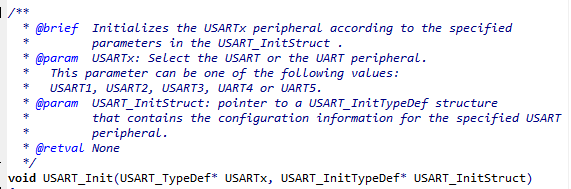

## 1. Interrupt
* 기존의 polling방식은 보드에 특정 입력을 받을 때 까지 while loop등을 이용해 입력이 들어올 때 까지 대기.
* 구현이 쉽지만 쓸데없이 자원을 낭비함.
* interrupt방식을 이용해 특정 이벤트 발생 시, 하던 작업을 멈추고 이벤트에 대한 처리를 할 수 있음.
* EXTI(External Interrupt) : 외부에서 신호가 들어올 때, 장치에 event나 interrupt가 발생되는 기능.
  * GPIOx, USART 등의 각 port의 n번 핀이 EXTI n line에 연결됨.
  * Mask Register를 통해 interrupt 발생 여부 확인
* NVIC : interrupt간 우선 순위 설정
  * preemption priority: interrupt handler가 실행되고 있는 도중, 다른 interrupt발생 시 처리 순서를 정하는 우선순위
  * sub priority : interrupt처리 대기 중일 때, 어떤 interrupt를 먼저 처리할 지 정하는 우선순위.(ex. 만약, A,B,C의 preemption이 모두 같고, sub priority는 A>B>C라고 가정. A interrupt실행 중 B,C interrupt가 발생했다고 가정. preemption이 모두 같으므로 A interrupt handler가 계속 실행되고 A handler가 끝나면 처리 대기중이던 B, C중 우선순위가 높은 B handler를 먼저 처리함.)
  * `misc.h` 파일에서 우선순위 설정에 관한 설명이 있음.
  * PriorityGroup이 존재. 총 4bit를 이용해 preemption및 sub priority의 우선순위를 할당할 수 있는데, Group에 따라 부여되는 bit수가 달라짐
  * ex. PriorityGroup1 사용 시, Preemption bit는 1개, Subpriority bit는 3개이므로 preemption은 0~1 우선순위를, subpriority는 0~7까지의 우선순위를 부여할 수 있음.
## 2. 코드+실험 과정
* 실험 과정에서, 함수 및 구조체의 정의를 확인할 수 있도록 `Go to Definition of [...]`을 적극적으로 활용함.
* 정의 및 선언부에서, 주석으로 설명된 부분을 참고해 함수 사용법이나 구조체 설정 방법을 익힘.
* 또한, // TODO 내에서 이미 되어있는 코드를 바탕으로 사용법을 예측함.
### 2_1. Clock 설정
```C
void RCC_Configure(void)
{
	// TODO: Enable the APB2 peripheral clock using the function 'RCC_APB2PeriphClockCmd'
	
	/* UART TX/RX port clock enable */
	RCC_APB2PeriphClockCmd(RCC_APB2Periph_GPIOA, ENABLE);
	/* JoyStick Up/Down port clock enable */
	RCC_APB2PeriphClockCmd(RCC_APB2Periph_GPIOC, ENABLE);
	/* JoyStick Selection port clock enable */
	// RCC_APB2PeriphClockCmd(RCC_APB2Periph_AFIO, ENABLE);
	/* LED port clock enable */
	RCC_APB2PeriphClockCmd(RCC_APB2Periph_GPIOD, ENABLE);
	/* USART1 clock enable */
	RCC_APB2PeriphClockCmd(RCC_APB2Periph_USART1, ENABLE);
	/* Alternate Function IO clock enable */
	RCC_APB2PeriphClockCmd(RCC_APB2Periph_AFIO, ENABLE);
}
```
* `RCC_APB2PeriphClockCmd`을 이용해 APB2 클락을 활성화해야 한다.
* `RCC_APB2PeriphClockCmd(RCC_APB2Periph_AFIO, ENABLE);`을 통해, 원하는 포트와 ENABLE을 이용하여, 해당 포트에 APB2 clock을 초기화해야함을 알 수 있었다.
* `RCC_APB2Periph_AFIO`의 definition으로 이동하여 APB2_peripheral 목록을 확인할 수 있었고, 해당 목록에서 필요한 GPIOx포트나 USART1을 찾아 clock을 초기화했다.  
  
### 2_2. GPIO 설정
``` C
void GPIO_Configure(void)
{
    GPIO_InitTypeDef GPIO_InitStructure_JoyStick;
    GPIO_InitTypeDef GPIO_InitStructure_Button;
    GPIO_InitTypeDef GPIO_InitStructure_LED;
    GPIO_InitTypeDef GPIO_InitStructure_UART_TX;
    GPIO_InitTypeDef GPIO_InitStructure_UART_RX;

	// TODO: Initialize the GPIO pins using the structure 'GPIO_InitTypeDef' and the function 'GPIO_Init'
	
    /* JoyStick up, down pin setting */
    GPIO_InitStructure_JoyStick.GPIO_Pin = GPIO_Pin_2 | GPIO_Pin_5;
    GPIO_InitStructure_JoyStick.GPIO_Mode = GPIO_Mode_IPD | GPIO_Mode_IPU;
    GPIO_Init(GPIOC, &GPIO_InitStructure_JoyStick);
	
    /* JoyStick selection pin setting */
    
    /* button pin setting */
    GPIO_InitStructure_Button.GPIO_Pin = GPIO_Pin_11;
    GPIO_InitStructure_Button.GPIO_Mode = GPIO_Mode_IPD | GPIO_Mode_IPU;
    GPIO_Init(GPIOD, &GPIO_InitStructure_Button);
    
    /* LED pin setting*/
    GPIO_InitStructure_LED.GPIO_Pin = GPIO_Pin_2 | GPIO_Pin_3 | GPIO_Pin_4 | GPIO_Pin_7;
    GPIO_InitStructure_LED.GPIO_Speed = GPIO_Speed_50MHz;
    GPIO_InitStructure_LED.GPIO_Mode = GPIO_Mode_Out_PP;
    GPIO_Init(GPIOD, &GPIO_InitStructure_LED);
	
    /* UART pin setting */
    //TX
    GPIO_InitStructure_UART_TX.GPIO_Pin = GPIO_Pin_9;
    GPIO_InitStructure_UART_TX.GPIO_Speed = GPIO_Speed_50MHz;
    GPIO_InitStructure_UART_TX.GPIO_Mode = GPIO_Mode_AF_PP;
    GPIO_Init(GPIOA, &GPIO_InitStructure_UART_TX);
	//RX
    GPIO_InitStructure_UART_RX.GPIO_Pin = GPIO_Pin_10;
    GPIO_InitStructure_UART_RX.GPIO_Mode = GPIO_Mode_IPD | GPIO_Mode_IPU;
    GPIO_Init(GPIOA, &GPIO_InitStructure_UART_RX);
}
```
* 레지스터를 이용해 GPIO를 설정할 때는 GPIOx_CRL, CRH를 이용해 원하는 핀 번호에 해당하는 field를 찾아 input, output 모드를 설정해야 했음.
* TODO 주석 설명에 따라, `GPIO_InitTypeDef` 구조체로 GPIO 설정을 한 뒤, `GPIO_Init`으로 GPIO 초기화를 진행하는 것으로 보였다. 
* 기존에 있던 LED pin setting 코드를 기반으로, 조이스틱과 버튼에 대한 GPIO설정을 진행했다. 조이스틱의 경우 down은 Pin2번, up은 pin 5번이고, 버튼은 pin11번이므로 `GPIO_Pin`을 `GPIO_Pin_2 | GPIO_Pin_5` 및 `GPIO_Pin_11`으로 설정했다. 
* 또한, 조이스틱과 버튼은 모두 입력 모드를 사용해야 하므로 Input with Pullup, Pulldown을 설정해야 한다. `GPIO_Mode_Out_PP`의 definition으로 이동해보니, Output push pull외에도 다른 mode를 설정할 수 있었고 그 중 input pullup, pulldown에 해당하는 `GPIO_Mode_IPD, GPIO_Mode_IPU`를 사용했다.  
  
* 이후 GPIO_Init()을 이용해 GPIO를 초기화하는데, LED 핀 초기화에서 사용하는 방법대로 첫 번째 매개변수는 GPIOx, 두 번째 매개변수로는 `GPIO_InitTypeDef`구조체의 주소를 넘겨줘서 진행하는 것을 알 수 있었다.
* UART TX, RX도 저번 주차에 나왔던 UART설정대로 진행했다.
### 2_3. EXTI 설정
```C
void EXTI_Configure(void)
{
    EXTI_InitTypeDef EXTI_InitStructure;

	// TODO: Select the GPIO pin (Joystick, button) used as EXTI Line using function 'GPIO_EXTILineConfig'
	// TODO: Initialize the EXTI using the structure 'EXTI_InitTypeDef' and the function 'EXTI_Init'
	
    /* Joystick Down */
    GPIO_EXTILineConfig(GPIO_PortSourceGPIOC, GPIO_PinSource2);
    EXTI_InitStructure.EXTI_Line = EXTI_Line2;
    EXTI_InitStructure.EXTI_Mode = EXTI_Mode_Interrupt;
    EXTI_InitStructure.EXTI_Trigger = EXTI_Trigger_Falling;
    EXTI_InitStructure.EXTI_LineCmd = ENABLE;
    EXTI_Init(&EXTI_InitStructure);

    /* Joystick Up */
    GPIO_EXTILineConfig(GPIO_PortSourceGPIOC, GPIO_PinSource5);
    EXTI_InitStructure.EXTI_Line = EXTI_Line5;
    EXTI_InitStructure.EXTI_Mode = EXTI_Mode_Interrupt;
    EXTI_InitStructure.EXTI_Trigger = EXTI_Trigger_Falling;
    EXTI_InitStructure.EXTI_LineCmd = ENABLE;
    EXTI_Init(&EXTI_InitStructure);
	
	/* Joystick Selection */

    /* Button */
    GPIO_EXTILineConfig(GPIO_PortSourceGPIOD, GPIO_PinSource11);
    EXTI_InitStructure.EXTI_Line = EXTI_Line11;
    EXTI_InitStructure.EXTI_Mode = EXTI_Mode_Interrupt;
    EXTI_InitStructure.EXTI_Trigger = EXTI_Trigger_Falling;
    EXTI_InitStructure.EXTI_LineCmd = ENABLE;
    EXTI_Init(&EXTI_InitStructure);
	// NOTE: do not select the UART GPIO pin used as EXTI Line here
}
```
* TODO 설명에 따라, `GPIO_EXTILineConfig`을 이용해 GPIO 핀을 EXTI line과 연결하고, `EXTI_InitTypeDef` 구조체를 이용해 EXTI 설정을 한 뒤, `EXTI_Init`으로 초기화를 진행해야 한다.
* Joystick Down 코드에 따라, `GPIO_EXTILineConfig`에는 GPIO_PortSourceX와 사용하려는 GPIO 핀 번호를 넣어야 됨을 확인할 수 있었다. 조이스틱과 버튼에 따라 맞는 핀 번호를 go to definition을 이용해 찾은 뒤, 설정을 했다.
* `EXTI_InitTypeDef`에서, Mode는 모두 interrupt를 사용하므로 동일하게 해줬고, Trigger는 joystick down에서 edge falling시 interrupt 발생시키도록 했으므로 또한 동일하게 설정했다. EXTI line을 사용해야 하기 때문에 LineCmd도 모두 ENABLE로 설정한 뒤, `EXTI_Init`으로 초기화를 진행한다.
### 2_4. USART 설정
```C
void USART1_Init(void)
{
	USART_InitTypeDef USART1_InitStructure;

	// Enable the USART1 peripheral
	USART_Cmd(USART1, ENABLE);
	
	// TODO: Initialize the USART using the structure 'USART_InitTypeDef' and the function 'USART_Init'
	USART1_InitStructure.USART_BaudRate = 9600;
    USART1_InitStructure.USART_WordLength = USART_WordLength_8b;
    USART1_InitStructure.USART_Mode = (USART_Mode_Rx | USART_Mode_Tx);
    USART1_InitStructure.USART_Parity = USART_Parity_No;
    USART1_InitStructure.USART_StopBits = USART_StopBits_1;
    USART1_InitStructure.USART_HardwareFlowControl = USART_HardwareFlowControl_None;
    USART_Init(USART1, &USART1_InitStructure);

    //...
```
* 첫 번째 TODO를 보니, `USART_InitTypeDef`를 이용해 USART설정을 한 뒤, `USART_Init`으로 초기화를 진행해야 하는 것을 알 수 있었다.
* 이번에는 미리 작성된 코드가 없기 때문에, `USART_InitTypeDef`의 definition으로 이동하여 어떻게 설정해야하는지 확인해야 했고, BaudRate, WordLength, StopBits, Parity, Mode, HardwareFlowControl을 설정해야 함을 알 수 있었다.  
  
* 각 설정에 대한 값들은 주석의 @ref로 표시된 이름을 검색하여 어떤 주소값을 이용해야 되는지 확인했다.
* 지난 주차에서 USART1 설정을 할 때, WordLength는 8bit, Parity는 None, Tx 및 Rx 활성화, Stop bit는 1bit, CTS 및 RTS는 비활성화 시켰으므로, 이 설정에 맞춰 USART_InitStructure를 설정해주었다. 
* BaudRate의 경우, Putty의 기본 baud rate가 9600이므로 여기서도 동일하게 9600으로 설정했다.
* `USART_Init`함수의 경우, 사용 방법을 찾기 위해 main.c에서 `USART_Init`을 입력한 뒤, go to definition으로 이동하여 확인해보니, 매개변수로 `(USART_TypeDef* USARTx, USART_InitTypeDef* USART_InitStruct)`을 받는 것을 알 수 있었다. 두 번째 매개변수의 타입은 `USART_InitTypeDef`의 포인터이므로, 앞서 설정한 InitStructure의 주소값을 넣어주면 됨을 알 수 있었고, 첫 번째 매개변수의 경우, 주석에 있는 @param을 확인하여, USART1,2,3 등의 번호가 들어감을 알 수 있었다. 우리는 USART1을 사용하므로, USART1을 매개변수로 넣어주었다.  
  
```C
    // TODO: Enable the USART1 RX interrupts using the function 'USART_ITConfig' and the argument value 'Receive Data register not empty interrupt'
	USART_ITConfig(USART1, USART_IT_RXNE, ENABLE);
```
* 다음 TODO를 보니, `USART_ITConfig`와 매개변수 값 Receive Data register not empty interrupt를 이용해 USART1 RX 인터럽트를 활성화하라고 되어있었다.
* 앞서 EXTI 설정 시, UART GPIO pin은 EXTI로 설정하지 말라는 주석이 있었던 이유가 여기서 interrupt 설정을 하기 때문이었던 것으로 보인다.
* `USART_ITConfig`을 main.c에서 입력하고, go to definition으로 확인해보니, 매개변수로 `(USART_TypeDef* USARTx, uint16_t USART_IT, FunctionalState NewState)`를 받는 것을 알 수 있었다. 역시 함수 위에 있는 주석의 @param부분을 확인해보니, USARTx는 앞선 함수와 마찬가지로 USART1을, NewState는 interrupt 활성화 여부를 설정해야 하므로 ENABLE로 설정했다. 또한, USART_IT를 확인하니, Receive Data register not empty interrupt에 해당하는 `USART_IT_RXNE`가 있어, 해당 값을 매개변수로 넣어주었다.

* 이 함수의 역할을 reference manual에서 찾기 위해, USART 레지스터 부분을 확인해보니 `USART_SR`레지스터가 CTS, TC, RXNE등의 여러 플래그를 가지고 있는 것을 확인할 수 있었다. 그 중에서, RXNE를 보니, USART통신을 통해 데이터를 받으면 1로 설정되고, 받지 않은 상태면 0으로 설정되는 것으로 보였다. 즉, USART의 경우, GPIO핀처럼 mask register를 통해 인터럽트 발생 여부를 확인하는 것이 아니라 별도의 레지스터를 쓰는 것으로 예상된다.  
  
### 2_5. NVIC 설정
```C
void NVIC_Configure(void) {

    NVIC_InitTypeDef NVIC_InitStructure;
    
    // TODO: fill the arg you want
    NVIC_PriorityGroupConfig(NVIC_PriorityGroup_2);

    // ...
```
* 우선, PriorityGroup을 설정해주어야 했다. 앞서 설명한 대로, PriorityGroup에 따라 우선순위를 부여할 수 있는 번호 범위가 달라지는데, 우리가 사용하는 interrupt는 조이스틱 위, 아래, 버튼, USART1 이렇게 4개이므로, 총 4개의 우선순위를 부여할 수 있는 2bit만 있으면 될 것이라 생각했다.
* PriorityGroup_2의 경우, pre-emption priority와 subpriority에 각각 2bit씩 부여하기 때문에, 총 4개의 우선순위를 설정할 수 있으므로, `NVIC_PriorityGroup_2`를 선택했다.
```C
    // Joystick Down
    NVIC_InitStructure.NVIC_IRQChannel = EXTI2_IRQn;
    NVIC_InitStructure.NVIC_IRQChannelPreemptionPriority = 0; // TODO
    NVIC_InitStructure.NVIC_IRQChannelSubPriority = 0; // TODO
    NVIC_InitStructure.NVIC_IRQChannelCmd = ENABLE;
    NVIC_Init(&NVIC_InitStructure);
    // Joystick Up
    NVIC_InitStructure.NVIC_IRQChannel = EXTI9_5_IRQn;
    NVIC_InitStructure.NVIC_IRQChannelPreemptionPriority = 1; // TODO
    NVIC_InitStructure.NVIC_IRQChannelSubPriority = 1; // TODO
    NVIC_InitStructure.NVIC_IRQChannelCmd = ENABLE;
    NVIC_Init(&NVIC_InitStructure);
    
    // User S1 Button
    NVIC_InitStructure.NVIC_IRQChannel = EXTI15_10_IRQn;
    NVIC_InitStructure.NVIC_IRQChannelPreemptionPriority = 2; // TODO
    NVIC_InitStructure.NVIC_IRQChannelSubPriority = 2; // TODO
    NVIC_InitStructure.NVIC_IRQChannelCmd = ENABLE;
    NVIC_Init(&NVIC_InitStructure);

    // UART1
	// 'NVIC_EnableIRQ' is only required for USART setting
    NVIC_EnableIRQ(USART1_IRQn);
    NVIC_InitStructure.NVIC_IRQChannel = USART1_IRQn;
    NVIC_InitStructure.NVIC_IRQChannelPreemptionPriority = 3; // TODO
    NVIC_InitStructure.NVIC_IRQChannelSubPriority =3; // TODO
    NVIC_InitStructure.NVIC_IRQChannelCmd = ENABLE;
    NVIC_Init(&NVIC_InitStructure);
```
* 이후, `NVIC_InitStructure`를 이용해 각 인터럽트에 대한 설정을 해주고, `NVIC_Init`를 이용해 초기화를 진행해야 했다.
* 미리 작성되어있던 UART1부분의 코드를 이용했는데, `NVIC_IRQChannel`의 경우 USART는 `USART1_IRQn`를 사용했기 때문에, 조이스틱이나 버튼의 NVIC설정은 다른 값을 넣어줘야 하는 것으로 보였다. `USART1_IRQn`의 definition으로 이동해보니, IRQn_Type이라는 이름의 열거형으로 interrupt number들이 정의되어 있는 것을 볼 수 있었다. 조이스틱 아래의 경우, EXTI2번이었으므로, `EXTI2_IRQn`를, 조이스틱 위는 EXTI5번이었으므로 5~9번을 나타내는 `EXTI9_5_IRQn`를, 버튼은 EXTI11이었으므로 10\~15번을 나타내는 `EXTI15_10_IRQn`를 사용했다.
* 우선순위의 경우, 사실상 조이스틱 조작과 버튼 입력은 led가 켜지는 방향만 바꿔주면 되기 때문에 인터럽트 handler를 처리하는 데 많은 시간이 들지 않을 것으로 예상했다. 그나마 UART통신의 경우, 일정 길이의 문자열을 handler내에서 보내야 했기 때문에 다른 handler에 비해서 실행 시간이 길게 걸릴 것으로 예상했고, UART통신 도중 다른 interrupt가 걸리면 들어온 interrupt들 먼저 처리하도록 우선순위를 제일 마지막에 두었다. 그 외 interrupt에 대해서는 순차적으로 0, 1, 2번을 부여하였다.
* subpriority의 경우에도, handler들의 실행시간이 짧기 때문에 대기 중인 interrupt handler중 아무 handler를 실행해도 괜찮을 것으로 판단하여 preemption과 동일하게 설정해주었다.
### 2_5. Handler
```C
void USART1_IRQHandler() {
	uint16_t word;
    if(USART_GetITStatus(USART1,USART_IT_RXNE)!=RESET){
    	// the most recent received data by the USART1 peripheral
        word = USART_ReceiveData(USART1);

        // TODO implement
        if(word == 'a') {
          //TODO
          mode=0;
        }
        else if(word == 'b') {
          //TODO
          mode=1;
        }

        // clear 'Read data register not empty' flag
    	USART_ClearITPendingBit(USART1,USART_IT_RXNE);
    }
}
```
* `USART1_IRQHandler`라는 이름을 통해, USART1통신에 의한 interrupt 발생 시 어떤 처리를 할지 정하는 handler임을 알 수 있었다.
* 내부에서는, `USART_ReceiveData`라는 함수를 사용하는 것을 통해, 컴퓨터로부터 받은 입력을 word에 저장하는 것으로 예상했고, return type이 uint16_t이므로 문자열이 그대로 들어올 것이라 예상했다.
* 실험의 목표 중 하나가 키보드로 'a'를 입력받으면 정방향으로 led를 순차적으로 출력하고, 'b'를 입력받으면 역방향으로 led를 순차적으로 출력해야 하는 것이므로, led가 켜지는 부분은 main()함수 내에서 정의하기로 하고, 켜지는 방향은 mode라는 전역변수를 두어, mode의 값에 따라 그 방향을 정하기로 했다. 따라서, word로 받은 문자가 어떤 문자인가에 따라 mode를 설정하는 코드를 작성했다.
```C
void EXTI15_10_IRQHandler(void) { // when the button is pressed

	if (EXTI_GetITStatus(EXTI_Line11) != RESET) {
		if (GPIO_ReadInputDataBit(GPIOD, GPIO_Pin_11) == Bit_RESET) {
			// TODO implement
			for(int i=0; msg[i]!='\0'; i++) {
                        sendDataUART1((msg[i]);
                    }
		}
        EXTI_ClearITPendingBit(EXTI_Line11);
	}
}
```
* `EXTI15_10_IRQHandler`라는 이름과 주석을 통해, 버튼을 눌렀을 때 어떤 처리를 할 지 정하는 handler임을 알 수 있었다.
* 버튼을 눌렀을 때는, msg에 저장된 문자열을 컴퓨터로 전송해야 하므로, 지난 주차 때 사용한 코드를 이용하여 문자열을 한 문자씩 보내는 코드를 작성했다.
```C
// TODO: Create Joystick interrupt handler functions
void EXTI2_IRQHandler(void) {
        if (EXTI_GetITStatus(EXTI_Line2) != RESET) {
            //TODO
            mode = 1;
        }
        EXTI_ClearITPendingBit(EXTI_Line2);
}

void EXTI9_5_IRQHandler(void) {
  if (EXTI_GetITStatus(EXTI_Line5) != RESET) {
            //TODO
            mode = 0;
  }
  EXTI_ClearITPendingBit(EXTI_Line5);
}
```
* 조이스틱 입력에 따른 handler는 직접 작성해야 했다.
* `startup_stm32f10x_cl.s`파일 내에서, 핀 번호에 해당하는 Handler이름을 찾아야 했고, 2번 핀과 5번핀에 각각 해당하는 `EXTI2_IRQHandler`와 `EXTI9_5_IRQHandler`를 작성했다.
* 조이스틱을 조작했을 때, 매개변수로 준 EXTI line의 bit가 1이 되었는지 확인하는(interrupt가 발생했는지 확인하는) `EXTI_GetITStatus`를 통해 interrupt의 발생 여부를 확인하여 mode를 설정해주었다. 이후, handler의 마지막 부분은 `EXTI_ClearITPendingBit`를 이용해 interrupt bit를 지워줘야 했는데, 이 부분을 나중에 찾아보니 interrupt가 발생한 이후, interrupt 발생 여부를 나타내는 bit를 지워주지 않으면 계속 interrupt가 발생한 상태로 남게 되어 handler가 반복적으로 동작하기 때문에, bit를 지워줘야 한다고 한다.
### 2_6. main 함수
```C
    // ...

    uint16_t led_pins[4] = {
      GPIO_Pin_7,
      GPIO_Pin_4,
      GPIO_Pin_3,
      GPIO_Pin_2,
    };
    int i = 0;
    
    while (1) {
    	// TODO: implement 
        GPIO_SetBits(GPIOD, led_pins[i]);
        Delay();
        GPIO_ResetBits(GPIOD, led_pins[i]);
        
        if(mode == 0) {
          i = (i+1) % 4;
        }
        else if(mode == 1) {
          i = ((i-1) + 4) % 4;
        }
    }
    return 0;
```
* main함수에서는 직접적으로 led를 켜 주고, mode의 값에 따라 켜지는 순서를 정해주기로 했다.
* GPIO에 대한 설정은 위에서 이미 했고, led를 켜기 위해서는 GPIOx_BSRR레지스터를 이용해야 했다. `stm32f10x_gpio.h`에서 살펴보니 `GPIO_SetBits`와 `GPIO_ResetBits`라는 함수가 해당 역할을 수행하는 함수인 것을 알게 되었고, SetBits를 통해 현재 led를 켠 후, 약간의 delay를 준 뒤 ResetBits로 현재 led를 끄면서 다음 led를 바로 다시 켜는 식으로 구현했다. 또한, mode값이 0이면 pin 7->4->3->2순으로, mode값이 1이면 pin 2->3->4->7순으로 켜지게 하여 방향을 정하도록 했다. 