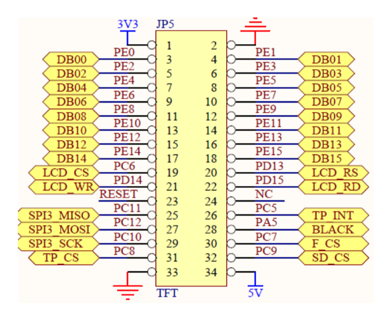
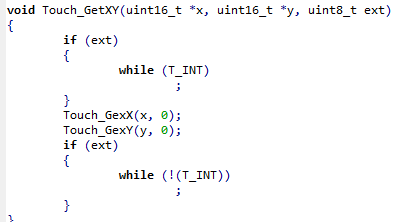
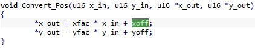
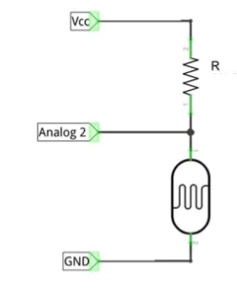
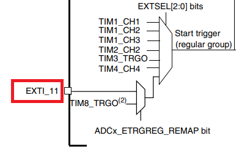

## 1. LCD
* LCD에 데이터를 쓰기 위해서는, 명령어 쓰기는 1. D/C를 low로, CS를 low로, WR을 low로 설정한 뒤 2. 명령어를 전송하고 3. CS를 high로, WR을 high로 설정하면 된다. 데이터 쓰기는 명령어 쓰기에서 D/C만 high로 설정하면 된다.
* 설정을 위해, TFT-LCD Pin맵을 이용해 timing 설정을 몇 번 핀을 통해 해줘야 하는지 확인했다.
  * D/C(RS. LCD_RS)는 PD13, CS(LCD_CS)는 PC6, WR(LCD_WR)은 PD14이므로, GPIOC와 GPIOD를 사용한다.
  
* LCD에는 문자열, 숫자를 출력할 수 있어야 하고 원을 그려야 한다. 또한, 터치를 했을 때 터치한 좌표를 받아올 수 있어야 한다. 이를 찾기 위해, 제공된 라이브러리의 헤더 파일을 통해, 관련된 동작을 하는 것으로 보이는 함수들을 찾아 사용했다.
* `lcd.h`
  * `void LCD_ShowString(u16 x0, u16 y0, u8 *pcStr, u16 PenColor, u16 BackColor);` : LCD에 문자열을 출력하는 함수. x0, y0는 문자열을 출력할 좌표로 보였고, pcStr은 문자열을 담은 주소, PenColor와 BackColor은 각각 문자열의 색과 문자열 배경의 색을 의미하는것으로 보였고, 헤더 파일 내의 Color부분을 넣는 것으로 보였다. 실제로 각 값을 넣어주니 정상 동작하는것을 확인했다.
  * `void LCD_ShowNum(u8 x, u8 y, u32 num, u8 len, u16 PenColor, u16 BackColor);` : LCD에 숫자를 출력하는 함수. 문자열 출력 함수와 대부분 비숫했고, num은 출력할 숫자, len은 출력할 숫자의 길이를 의미했다. 실제 숫자값보다 len이 길다면, 숫자가 오른쪽 정렬된 것처럼 출력되었다.
  * `void LCD_DrawCircle(uint16_t x0, uint16_t y0, uint8_t r);` : LCD에 원을 그려주는 함수. x0, y0는 중심 좌표고, r은 radius, 지름을 의미하는것으로 보였고, 값을 넣어주니 정상 동작했다.
  * 
* `touch.h`
  * `Touch_GetXY(uint16_t *x, uint16_t *y, uint8_t ext);` : LCD를 터치했을 때, 터치한 곳의 좌표값을 불러오는 함수. x, y가 포인터이고, 해당 함수의 return값이 없었으므로, x와 y부분에 포인터를 넣어주면 해당 포인터가 가리키는 곳에 x, y좌표값을 각각 저장함을 알 수 있었다. 하지만, ext값은 무엇을 넣어줘야할지 몰라 `touch.c`파일을 보니, ext가 true이면 loop문을 실행하는 것을 볼 수 있었다. 즉, ext값에 1을 넣어주면 touch를 받을 때 까지 계속 대기할 것이라 생각했고, 예상대로 동작했다.
  
  * 처음 실험할 때는 `Touch_GetXY()`만 사용하여 좌표값을 받을려고 했는데, 받은 좌표값이 실제 LCD 상의 좌표값과 일치하지 않아 DrawCircle이 이상하게 동작하는 것을 확인할 수 있었다. 이는 Touch_GetXY()로 받는 값과 실제 LCD의 해상도가 달라 발생하는 문제였고, `Touch.h`의 `Convert_Pos()`를 이용하여 좌표값을 LCD상의 실제 좌표값으로 변환해 해결했다.
  * 하지만 `Convert_Pos()`만 이용했을 때, 반환받은 좌표값이 모두 0으로 나오는 문제가 있었고, touch.c에서 `Convert_Pos()`의 동작을 확인해보니, xfac, xoff, yfac, yoff라는 값을 이용해 좌표를 조절함을 확인했다. 이 값들은 `Touch_Adjust()`에서 설정되는 것을 찾아냈고, `Convert_Pos()` 호출 전에 `Touch_Adjust()`를 호출하여 문제를 해결했다.
    
  ```c
  void Touch_Adjust(void)
  {
    // ...
    xfac = (float)220 / (pos_temp[1][0] - pos_temp[0][0]);
    xoff = (240 - xfac * (pos_temp[1][0] + pos_temp[0][0])) / 2;

    yfac = (float)300 / (pos_temp[2][1] - pos_temp[1][1]);
    yoff = (320 - yfac * (pos_temp[2][1] + pos_temp[1][1])) / 2;
  }
  ```
## 2. ADC
* 우선, ADC를 사용할 핀을 찾기 위해 회로도를 확인했고, ADC12_INx가 ADC를 이용할 수 있는 핀인 것으로 보여 ADC12_IN10(PC0)를 사용하기로 했다. 따라서, 조도 센서 회로의 Analog 2부분을 기판 뒷면의 PC0부분에 꽂아 사용했다.

* ADC 사용을 위해 강의 자료에 나와있던 ADC 설정 함수들을 이용했다. 또한, `ADC_Init`내에서 사용하는 InitStructure인 `ADC_InitTypeDef`도 설정해주었다.
* `ADC_InitTypeDef`
  * ADC_Mode : ADC의 모드를 설정한다. 다양한 모드가 있었지만, 우리는 조도 센서 하나만 사용, 즉 1개의 채널만 사용하므로 모드의 여부는 크게 상관 없을 거라 생각했고, 여러 채널이 독립적으로 동작하는 Independent모드를 선택했다.
  * ADC_ScanConvMode, ADC_ContinuousConvMode : Scan conversion mode, Continuous conversion mode 여부를 설정한다. 역시 1개의 채널만 사용하므로 어떤 값을 줘도 될 거라고 생각하여 둘 다 활성화하였다.
  * ADC_ExternalTrigConv : 외부 트리거에 의한 ADC 작동 여부를 설정한다. 외부 요인에 상관없이 ADC를 지속적으로 계속 동작시켜야 하므로, `ADC_ExternalTrigConv_None`(없음)으로 설정했다.
  * ADC_DataAlign : ADC로 받은 값을 저장할 때 bit를 오른쪽 정렬할지, 왼쪽 정렬할 지 결정한다. 정렬 방식은 상관없다 생각하여 Right align으로 설정했다.
  * ADC_NbrOfChannel : ADC에서 사용할 채널 수를 설정한다. 하나의 조도 센서만 사용하므로, 1개의 채널만 사용한다.
* `ADC_RegularChannelConfig` : ADC의 regular channel에 대한 설정을 해준다.
  * 매개변수
  * ADCx : ADC1을 사용하므로, 넣어준다.
  * ADC_Channel : ADC12_IN10을 사용하므로, Channel10을 넣어준다.
  * rank : 여러 채널의 ADC에 대해, 그 순서를 설정해주는 것으로 예상했고, 하나의 채널만 사용하기 때문에 1을 넣어줬다.
  * ADC_SampleTime : Sampling time을 설정한다. capacitor가 충전될 때 까지의 cycle을 설정하므로, 특정 값 이상만 되기만 해도 동작한다고 했으므로, 높은 값으로 설정해주었다.
## 3. 코드
```C
void RCC_Configure(void)
{
    // Clock 설정 함수
	/* ADC1 Clock enable */
	RCC_APB2PeriphClockCmd(RCC_APB2Periph_ADC1, ENABLE);    // ADC1을 위한 클락 설정
        
    RCC_APB2PeriphClockCmd(RCC_APB2Periph_GPIOC, ENABLE);   // ADC1입력을 받는 GPIOC 클락 설정
}
```
```C
void ADC1_Configure(void) {
    // ADC1 설정 함수
    ADC_InitTypeDef ADC_InitStructure;
    ADC_InitStructure.ADC_Mode = ADC_Mode_Independent;    // ADC Independent mode
    ADC_InitStructure.ADC_ScanConvMode = ENABLE;          // Scan conversion 사용
    ADC_InitStructure.ADC_ContinuousConvMode = ENABLE;    // Continuous conversion 사용
    ADC_InitStructure.ADC_ExternalTrigConv = ADC_ExternalTrigConv_None;   // External trigger 사용 안함
    ADC_InitStructure.ADC_DataAlign = ADC_DataAlign_Right;    // data bit 오른쪽 정렬
    ADC_InitStructure.ADC_NbrOfChannel = 1;   // 채널 수 1개 사용
    ADC_RegularChannelConfig(ADC1, ADC_Channel_10, 1, ADC_SampleTime_239Cycles5); // ADC1의 채널 10 1개에 대해 sampling time 239.5 cycle 적용
    ADC_Init(ADC1, &ADC_InitStructure);   // ADC1를 ADC_InitTypeDef로 설정
}
```
```C
void ADC1_start(void) {
    // ADC1을 시작하는 함수들.
    // interrupt 설정을 위한 NVIC_Configure() 이후에 호출해준다.
    ADC_ResetCalibration(ADC1);
    ADC_StartCalibration(ADC1);
    ADC_SoftwareStartConvCmd(ADC1, ENABLE);
}
```
```C
void GPIO_Configure(void)
{
    // GPIO 설정 함수
    GPIO_InitTypeDef GPIO_InitStructure;

    GPIO_InitStructure.GPIO_Pin = GPIO_Pin_0;           // ADC12_IN10. GPIOC 0
    GPIO_InitStructure.GPIO_Mode = GPIO_Mode_AIN;       // Analog In
    GPIO_Init(GPIOC, &GPIO_InitStructure);
}
```
```C
void NVIC_Configure() {
    // interrupt를 위한 NVIC 설정
    // 다른 부분은 이전의 NVIC 설정과 동일하고, IRQChannel만 IRQn_Type에서 찾아 ADC1, 2로 설정해주었다.

    NVIC_InitTypeDef NVIC_InitStructure;

    NVIC_InitStructure.NVIC_IRQChannel = ADC1_2_IRQn;

    //...
    NVIC_Init(&NVIC_InitStructure);

    ADC_ITConfig(ADC1, ADC_IT_EOC, ENABLE); // ADC에 대한 Interrupt 설정. 2번째 매개변수는 어떤 interrupt를 사용할지 결정.
                                            // ADC 변환이 끝날 때 마다 interrupt하는 EOC, 
                                            // Analog watchdog에 의한 AWD,
                                            // injected conversion때 마다 하는 JEOC 중
                                            // 현재 빛의 값 변환이 끝날 때 마다 그 값을 받아와야 하므로 EOC 사용.
    ADC_Cmd(ADC1, ENABLE);  // ADC 활성화
}
```
* 여기서, 처음에는 `ADC_ITConfig`와 `ADC_Cmd`와 더불어 `ADC1_start`내의 함수들을 모두 `ADC1_Configure()`안에 넣었다. 이후, `ADC1_Configure()`한 뒤, `NVIC_Configure()`를 해 주니, 조도 센서의 값은 정상적으로 읽어와졌지만, interrupt에서 벗어나지 못하는 문제가 생겼다.
* 인터럽트 설정 전에 ADC의 interrupt 설정을 먼저 해준게 원인이라 생각해서, NVIC설정이 끝난 뒤 ADC_ITConfig()이후를 실행시키도록 순서를 바꾸니 이 문제가 해결되었다.
```C
void ADC1_2_IRQHandler(void) {
    // ADC1 interrupt handler
    ADC_GetITStatus(ADC1, ADC_IT_EOC);
    lightVal = ADC_GetConversionValue(ADC1);    // ADC1을 이용해 받은 값을 전역변수 lightVal에 저장
    ADC_ClearITPendingBit(ADC1, ADC_IT_EOC);
}
```
```C
int main(void) {
    //...
    RCC_Configure();
    GPIO_Configure();
    ADC1_Configure();   // ADC 설정 후
    // EXTI_Configure();
    NVIC_Configure();   // NVIC 설정한 뒤
    
    LCD_Init();         // LCD 설정,
    Touch_Configuration();  // LCD 터치 설정
    Touch_Adjust();     // 터치 범위 조정하고
    LCD_Clear(WHITE);   // LCD화면을 하얀 색으로 초기화.
    
    ADC1_start();       // 이후 ADC1이 동작하도록 설정.

    while (1) {
    	// TODO: implement 
        LCD_ShowString(50, 50, "MON_Team01", BLACK, WHITE); // MON_Team01 출력
        
        Touch_GetXY(&xpos, &ypos, 1);                       // xpos, ypos에 x,y좌표 값을 저장
        Convert_Pos(xpos, ypos, &realx, &realy);            // 받은 xy좌표값을 <240, <320사이의 값으로 변환
        
        LCD_DrawCircle(realx, realy, 10);               // 터치한 곳에 원 그리기
        LCD_ShowNum(50, 65, realx, 10, BLACK, WHITE);   // x좌표 출력
        LCD_ShowNum(50, 80, realy, 10, BLACK, WHITE);   // y좌표 출력
        LCD_ShowNum(50, 95, lightVal, 4, BLACK, WHITE); // 조도 센서 값 출력
    }
}
```
* 처음에는, 이전에 했던 interrupt방식과 ADC1의 block diagram을 통해 EXTI설정도 해줘야 된다고 생각해 GPIOC 0(ADC10)번을 EXTI11에 연결해주는 `EXTI_Configure()`도 main내에서 실행시켰다.
* 하지만, EXTI11은 ADC1의 external trigger에 사용하는 것이었고, interrupt의 발생은 ADC가 변환을 완료할 때 마다 발생시키므로 여기서는 이전 방식대로 EXTI는 사용할 필요가 없었다. EXTI_Configure()를 주석 처리해도 정상 동작함을 확인할 수 있었다.


### 3_1. 코드 전체
<details>
<summary>전체 코드</summary>
```C
#include "stm32f10x.h"
#include "stm32f10x_exti.h"
#include "stm32f10x_gpio.h"
#include "stm32f10x_usart.h"
#include "stm32f10x_rcc.h"
#include "stdio.h"
#include "lcd.h"
#include "touch.h"
#include "misc.h"

/* function prototype */
void RCC_Configure(void);
void GPIO_Configure(void);
void NVIC_Configure(void);
void ADC_Configure(void);
void Delay(void);

int color[12] = {WHITE,CYAN,BLUE,RED,MAGENTA,LGRAY,GREEN,YELLOW,BROWN,BRRED,GRAY};

uint16_t xpos;
uint16_t ypos;
uint16_t realx;
uint16_t realy;
int lightVal;

void RCC_Configure(void)
{
	/* ADC1 Clock enable */
	RCC_APB2PeriphClockCmd(RCC_APB2Periph_ADC1, ENABLE);
	
	/* Alternate Function IO clock enable */
	RCC_APB2PeriphClockCmd(RCC_APB2Periph_AFIO, ENABLE);
        
        RCC_APB2PeriphClockCmd(RCC_APB2Periph_GPIOC, ENABLE);
}

void ADC1_Configure(void) {
  ADC_InitTypeDef ADC_InitStructure;
  ADC_InitStructure.ADC_Mode = ADC_Mode_Independent;
  ADC_InitStructure.ADC_ScanConvMode = ENABLE;
  ADC_InitStructure.ADC_ContinuousConvMode = ENABLE;
  ADC_InitStructure.ADC_ExternalTrigConv = ADC_ExternalTrigConv_None;
  ADC_InitStructure.ADC_DataAlign = ADC_DataAlign_Right;
  ADC_InitStructure.ADC_NbrOfChannel = 1;
  ADC_RegularChannelConfig(ADC1, ADC_Channel_10, 1, ADC_SampleTime_239Cycles5);
  ADC_Init(ADC1, &ADC_InitStructure);
}

void ADC1_start(void) {
    ADC_ResetCalibration(ADC1);
    ADC_StartCalibration(ADC1);
    ADC_SoftwareStartConvCmd(ADC1, ENABLE);
}

void GPIO_Configure(void)
{
    GPIO_InitTypeDef GPIO_InitStructure;

    GPIO_InitStructure.GPIO_Pin = GPIO_Pin_0;      // ADC12_IN10
    GPIO_InitStructure.GPIO_Mode = GPIO_Mode_AIN;       // Analog In
    GPIO_Init(GPIOC, &GPIO_InitStructure);
  
}

void EXTI_Configure(void)
{
  EXTI_InitTypeDef EXTI_InitStructure;
  
  GPIO_EXTILineConfig(GPIO_PortSourceGPIOC, GPIO_PinSource0);   // GPIOC_0
  EXTI_InitStructure.EXTI_Line = EXTI_Line11;
  EXTI_InitStructure.EXTI_Mode = EXTI_Mode_Interrupt;
  EXTI_InitStructure.EXTI_Trigger = EXTI_Trigger_Falling;
  EXTI_InitStructure.EXTI_LineCmd = ENABLE;
  EXTI_Init(&EXTI_InitStructure);
}

void NVIC_Configure() {
   NVIC_InitTypeDef NVIC_InitStructure;

   NVIC_PriorityGroupConfig(NVIC_PriorityGroup_1);

   NVIC_InitStructure.NVIC_IRQChannel = ADC1_2_IRQn;
   NVIC_InitStructure.NVIC_IRQChannelCmd = ENABLE;
   NVIC_InitStructure.NVIC_IRQChannelPreemptionPriority = 0x00;
   NVIC_InitStructure.NVIC_IRQChannelSubPriority = 0x00;
   NVIC_Init(&NVIC_InitStructure);
   
   ADC_ITConfig(ADC1, ADC_IT_EOC, ENABLE);
   ADC_Cmd(ADC1, ENABLE);

}

void ADC1_2_IRQHandler(void) {
    ADC_GetITStatus(ADC1, ADC_IT_EOC);
    lightVal = ADC_GetConversionValue(ADC1);
    //printf("%d\n", lightVal);
    ADC_ClearITPendingBit(ADC1, ADC_IT_EOC);
}

int main(void)
{

    SystemInit();

    RCC_Configure();

    GPIO_Configure();

    ADC1_Configure();
    
    // EXTI_Configure();

    NVIC_Configure();
    
    LCD_Init();
    Touch_Configuration();
    Touch_Adjust();
    LCD_Clear(WHITE);
    
    ADC1_start();

    while (1) {
    	// TODO: implement 
        LCD_ShowString(50, 50, "MON_Team01", BLACK, WHITE);
        
        Touch_GetXY(&xpos, &ypos, 1);
        Convert_Pos(xpos, ypos, &realx, &realy);        // touch adjust ???
        
        LCD_DrawCircle(realx, realy, 10);
        LCD_ShowNum(50, 65, realx, 10, BLACK, WHITE);
        LCD_ShowNum(50, 80, realy, 10, BLACK, WHITE);
        LCD_ShowNum(50, 95, lightVal, 4, BLACK, WHITE);
    }
    return 0;
}    
```
</details>